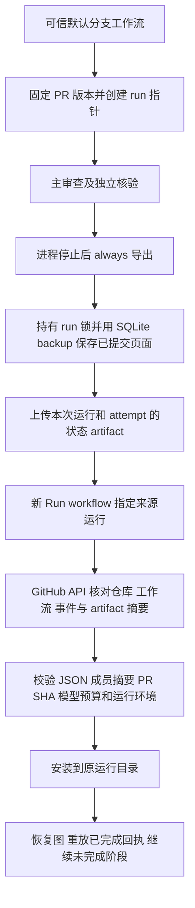

# GitHub Actions checkpoint 保存与恢复

## 1. 恢复的是同一次审查

`github-ci --cloud-checkpoint` 为首次运行分配 `ci-Actions运行编号-尝试次数`。主审查与独立核验仍使用原来的 LangGraph SQLite checkpoint、工具回执、上下文片段索引和冻结反馈。恢复时复用同一个 Harness run ID；模型、工具和未知用量次数继续累计。

这与跨 job 人工记忆不同：人工反馈影响新审查；checkpoint 延续旧审查。恢复不会重新读取当前反馈文件来替换旧快照。

## 2. 保存与恢复流程



归档包含 `manifest.json`、`artifacts.json`、`checkpoint.sqlite3`、`executions.sqlite3`，以及存在时的 `review.json`、`failed.json`。`cloud-state.json` 记录生产工作流、Harness 提交、来源链、运行配置、成员大小和 SHA256。GitHub artifact 外层 ZIP 只允许包含 `checkpoint.zip`。

两个 SQLite 文件通过备份接口复制，包含已提交的 WAL 页面；直接复制主数据库文件可能遗漏尚在 WAL 的记录。导出持有 run 锁，活动审查不能同时导出。归档不包含 `.env`、整个 Git 工作区或新建的人工记忆数据库，但会包含当次消息、代码材料和冻结反馈。状态 artifact 使用 7 天保留期，访问权限遵循业务仓库的 Actions artifact 权限。

## 3. 部署与操作

使用新版 [工作流模板](../.github/workflows/review-pr.yml)生成固定提交的业务调用方，方法见 [GitHub 配置](GITHUB_SETUP.md)。增加仓库变量：

| Variable | 值 | 作用 |
| --- | --- | --- |
| `HARNESS_CHECKPOINT_ENABLED` | `true` | 保存状态，允许新运行指定来源恢复 |
| `HARNESS_PUBLISH` | `false` | 当前云端恢复支持预览模式 |

工作流新增 `actions:read` 权限，用于核对和下载来源 artifact；GitHub token 不会转发给存储下载地址。开启 checkpoint 时，同一 PR 的工作流不主动取消正在运行的 job。CLI 审查进程最多运行 8 分钟，整个 job 上限仍为 15 分钟，为导出和上传留出时间。

### 普通中断后恢复

1. 查看失败运行的 `harness-运行编号-attempt` 诊断，确认 `checkpoint-export.json` 为 `saved`，并有 `harness-state-运行编号-attempt`。
2. 创建新的 **Run workflow**，分支选择 `main`，填写相同 `pr_number`，在 `resume_run_id` 中填写来源 Actions 运行编号，在 `resume_attempt` 中填写来源尝试次数。
3. **不要点击来源运行的 Re-run jobs**。本项目真实重跑验收中，上一尝试的 artifact 在新 job 开始前已消失，见[失败尝试](https://github.com/Bin-poco/PharosRAG/actions/runs/37128096558/attempts/2)。代码明确拒绝 Re-run，避免误把重新执行当成恢复；这个检查无法阻止 GitHub 先删除旧 artifact。
4. 查看 `automation.json.restored_from`、`review.json.resumed` 和累计 `budget_usage`。已有意见与核验完成时，恢复直接读取结果，不会再请求模型。

没有 artifact、已经过期或版本不兼容时，恢复会拒绝；创建新的 Run workflow 并留空 `resume_run_id` 开始新审查。没有保存状态的旧版运行不能直接恢复。

### 可重复的阶段暂停实验

首次手动运行选择 `pause_after_review=true`，主审查完成后保存状态，`automation.json.status=paused`、`stage=before_verification`，尚未生成完整核验与发布预览。之后新建运行指定来源，继续核验；恢复运行不会再次暂停。暂停运行页面绿色只表示状态保存成功，不表示整个审查已完成。

## 4. 身份和信任边界

下载先核对 GitHub 返回的仓库 ID、默认分支、工作流 ID/路径、已完成的 run/attempt、事件类型、artifact 所属 run 与 repository ID、有效期及 SHA256。只接受本仓库的 `workflow_dispatch` 和 `pull_request_target` 可信工作流；手动来源必须运行于默认分支。普通 `pull_request` 事件的 artifact 不能进入恢复路径。

解包前检查成员名、重复项、大小、加密与符号链接；再读取 JSON 校验生产信息、固定 Harness 提交、运行身份、PR 编号/base/head、配置和全部成员摘要。通过后才将 SQLite checkpoint 放进运行目录供 LangGraph 使用。保存的图包含可反序列化数据，摘要仅验证内容一致性，可信生产工作流来源是必要条件。

恢复绑定相同绝对工作目录、Python 版本、操作系统、CPU 架构和关键依赖版本，以及已有实现/技能摘要、模型配置、预算与执行策略。hosted runner 的内核构建字符串可变化，不影响兼容性；Python、依赖或 Harness 提交变化则拒绝恢复。PR 标题变化可以接受，保留原标题；代码版本或 PR 身份变化必须新建 run。

## 5. 当前限制

- 仅支持预览、语法检查、非增量模式；与 `--send` 或 `--incremental` 同时使用会明确拒绝。
- 完成回执可重放；工具处于 started、结果未知时仍沿用现有拒绝机制，不能保证外部操作恰好一次。当前云端入口不自动授权未知工具重试，可新建审查。
- 模型失败或步骤超时之后，需要导出与上传步骤实际完成。整台 runner 消失、job 被强制取消、上传失败或首次 checkpoint 尚未形成，不能保证恢复。此时选择新运行。
- 最多 32 MB 压缩归档、128 MB 展开状态、单个 JSON 16 MB。大小和保留期是当前原型的明确上限。
- 没有持久队列、数据库服务或跨机器路径迁移。后续新增[独立的跨 job 语法缓存](CLOUD_SYNTAX_CACHE.md)，可与恢复同时开启；云端增量调度基线未共享。恢复不等于审查质量已验证，也不等于生产 SLA。

## 6. 源码学习与验证

按顺序阅读 [工作流](../.github/workflows/review-pr.yml) → [CLI](../src/pr_review_harness/cli.py) → [cloud_state.py](../src/pr_review_harness/cloud_state.py) → [RunStore](../src/pr_review_harness/persistence.py) → [恢复测试](../tests/test_cloud_state.py)。

```bash
uv run pytest -q tests/test_cloud_state.py
```

专项使用真实 LangGraph 图和 SQLite：主模型在检查完成后失败，恢复不重复检查；核验回执已提交但图未提交，恢复重放该回执；已完成两阶段恢复不增加调用；记忆数据库删除后仍使用原冻结反馈。其他测试覆盖 WAL、运行锁、PR/配置/环境失配、成员篡改、来源伪造和下载凭证隔离。

2026-10-03 最终版本本机完整回归 **311 项通过，140.01 秒，包含 Docker**；新增恢复专项 35 项。修正普通入口反馈加载顺序后，记忆、自动入口与云端恢复联合专项 78 项通过。

面试自检：为什么不能只保存 `review.json`？为什么需要 SQLite backup？为什么不能下载任意 PR artifact 后直接恢复？为什么更换 runner 不清零预算？为什么“always 上传”仍不能保证强制取消后的恢复？

GitHub 行为依据：[Artifacts REST API](https://docs.github.com/en/rest/actions/artifacts)、[Workflow runs REST API](https://docs.github.com/en/rest/actions/workflow-runs)、[下载工作流 artifacts](https://docs.github.com/en/actions/how-tos/manage-workflow-runs/download-workflow-artifacts)。

## 7. 真实云端验收（2026-10-03）

PharosRAG 默认分支部署 `483609e8e592c8caa02a35e91bb0bd55ee3467d4`，固定 Harness `e15893bdc6dc4cad4d67e1e12d98261dc47a9758`；远程工作流与提案字节一致，精确提案通过 actionlint。`HARNESS_CHECKPOINT_ENABLED=true`、`HARNESS_PUBLISH=false`、`HARNESS_MEMORY_ENABLED=true`。

目标是同一个人工构造的 [Draft PR #5](https://github.com/Bin-poco/PharosRAG/pull/5)，使用真实 DeepSeek `deepseek-flash`、关闭 thinking。三个独立 Actions run 均成功：

| 运行 | 操作与结果 | 累计模型 / 工具尝试 |
| --- | --- | --- |
| [37128501642](https://github.com/Bin-poco/PharosRAG/actions/runs/37128501642) | 主审查完成，核验前暂停，上传状态 | 4 / 7 |
| [37128615856](https://github.com/Bin-poco/PharosRAG/actions/runs/37128615856) | 新运行指定上一来源；复用主审查，只继续核验，生成预览 | 7 / 11 |
| [37128744336](https://github.com/Bin-poco/PharosRAG/actions/runs/37128744336) | 新运行指定已完成来源；主审查和核验均恢复，无新增调用 | 7 / 11 |

原 Harness run ID `ci-37128501642-1` 贯穿三次运行。意见、证据、主阶段消息/请求/片段索引及冻结反馈一致；后两次的核验结论、请求/索引和完整执行回执一致，仅当前恢复耗时允许变化。来源归档摘要、每个内部文件摘要、实际源码 checkout 与实现摘要均已核对。

主阶段 3 个源码片段、4 次请求；核验阶段 1 个片段、3 次请求。完整源码摘要与固定 Git 对象一致，各请求的索引摘要可由 trace 前缀重建。确认规则仍出现在 4/4 次主请求，恢复不重新导入反馈来改变输入。共 7 次模型、11 次工具尝试，已报告 29,822 tokens，用量未知为 0；不代表提供方隐藏重试或精确费用保证。

PR 保持 Draft、未合并；远程审查、行内意见和普通评论均为 0。检查 47 个日志/状态文件及归档内部成员，未发现本机已知密钥或常见凭证格式。结构化证据见 [cloud-recovery-20261003.json](validation/cloud-recovery-20261003.json)，原始文件仅保存于本机 `outputs/cloud-recovery/`，云端 artifact 保留 7 天。

这次云端验证采用主审查完成后的受控暂停；正在执行时的模型失败和工具回执中断由离线真实图测试覆盖。实际 Re-run 失败被保留为工程发现，并据此修正入口；不声称已支持直接 Re-run 恢复、硬取消恢复、自动发布或生产 SLA。小型新增文件 PR 的核验仍是模型意见，不能据此推导准确率或成本改善。
