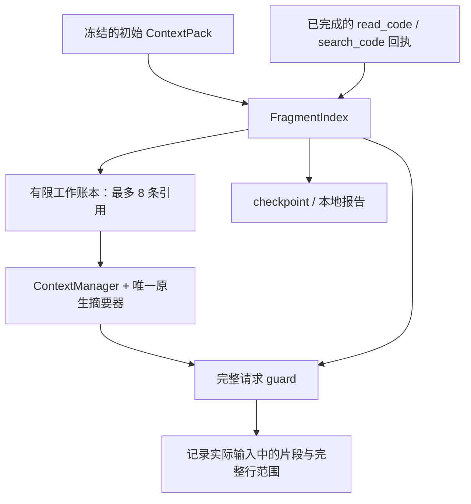

# 统一代码片段索引

## 解决什么问题

原来初始材料、`read_code` 和 `search_code` 各自保存原文与来源，缺少按文件、版本和行号查找的统一入口。历史摘要后，工具事实仍能恢复，但很难直接回答“这一轮输入中还保留了哪些代码”。

现在主审查使用 `FragmentIndex`，将这些材料映射到同一组片段 ID。它从冻结 ContextPack 和工具回执确定性重建，继续使用原有 Snapshot、ReviewSession、ContextManager、工作账本与 checkpoint。索引本身不调用模型。

## 三种状态必须区分

| 状态 | 保存位置 | 能说明什么 |
|---|---|---|
| 已归档片段 | `context.assembly.fragment_index.records` | 原始材料或工具结果中存在这段内容，可以追溯来源 |
| 本次字面代码输入 | `context.assembly.requests[].source_fragments` | 原生摘要后、最终 guard 处，这次组装请求仍包含哪些完整/部分源代码行 |
| 片段引用 | 工作账本 `fragments` | 保存文件、版本、行号与 ID，必要时用 `read_code` 重新读取原文 |

引用、摘要和工具结果外置后的文件指针均不计作字面代码输入。请求记录说明组装的输入，不证明模型理解代码、服务商成功处理请求或文件已完整审查。失败请求的装配信息保存在失败报告中；恢复后的已提交请求历史来自 checkpoint。



## 片段如何定位

记录包含 `repo_id`、`path`、`version`、固定提交 `sha`、`line_range`、`complete`、规范化代码的 `text_sha256`、来源 `origins`，以及可用的静态 Python 符号关联。

- `base` 指 PR 的 **merge base**，`head` 指本次固定的 HEAD，两版分开记录。
- diff 上下文行、删除行和新增行按 hunk 计数，分别定位到 base/head。改名文件使用 Snapshot 提供的旧路径定位 base。
- 邻域、测试与调用方从生成的编号格式定位；配置从第一行定位。分散片段保留各自行范围，间隔里的代码不算已归档。
- `ContextItem` 保存种类、在初始材料中的字符位置、实际源文本前缀长度、完整行前缀长度。裁剪标记与代码中的同名字符串分开处理。
- `read_code` 使用实际 `returned_range`，截断末行单独成为部分片段。失败/空读取、列文件和虚拟文件读取不产生源代码片段。
- `search_code` 每个命中是一行，最多展示 240 字符；长行的 `text_truncated=true` 表明它是部分片段。旧回执缺少这个标志时也保守处理。
- 符号链接目标和 submodule 提交等 diff 元数据不会当成可通过 `read_code` 获取的普通源码，记录在 `unsupported_source_fragments`。

代码位置统一按 Git 的 LF 换行计算。Unicode 行分隔字符不会凭空增加 Git 行号；CRLF 在片段摘要中规范化成 LF。`text_sha256` 是去掉编号/diff 前缀后以 LF 连接的片段代码摘要，不是整个 Git blob 的摘要。含 bare CR 的文件不建立 Python AST 符号关联，避免 Python 与 Git 的行号含义不同。

片段 ID 根据仓库、文件、版本、提交、行范围、完整性和代码摘要生成。同一段完整代码通过不同入口返回时合并来源；重叠但范围不同的片段仍有不同 ID。变化后的 SHA 或部分返回不会冒充原来的完整片段。

## 符号、容量与预算

Python AST 可关联 `Engine.compute` 等类/嵌套函数名称与声明范围。关联仅说明片段与静态声明重叠，不说明整个函数已展示，也不是完整调用图。

分析最多扫描 80 个文件、单文件 64,000 字节、累计 2,000,000 字节。语法错误或超限时仍保存代码位置并记录 `symbol_status`。每片段最多显示 8 个相关声明，额外数量见 `omitted_symbols`。分析从固定 Git blob 获取元数据，不把额外源码注入模型，也不计作模型阅读。

索引最多保存 512 条片段、1,000,000 字节序列化记录，每片段最多 32 个来源。超限省略整条新增片段/来源并计数；原始 artifacts 和 trace 继续保留。索引省略不代表原始代码没进入请求。

工作账本最多携带 8 条近期引用，仍服从 `working_chars` 与完整请求预算。空间不足时先省略旧引用，再按原有规则缩减读取/证据条目，保持合法 JSON。引用会占用输入空间，尚未测量它对质量、重复读取或 token 成本的影响。

## 实际输入如何记录

`ContextManager` 在原生摘要之后检查实际消息：

1. 初始用户材料仍存在时，根据本次实际展示长度计算可见范围；裁剪到半行时，该行只进入 `partial_ranges`。
2. 只有真实 `read_code` / `search_code` 工具消息且 JSON 匹配回执，才计入工具原文输入；外置指针与摘要不匹配。
3. `initial_display_present=false` 表示初始消息已不在请求中，展示字符数为 0，不继续沿用启动时的展示 hash。
4. 记录索引摘要、当时 trace 条数与省略数。`source_fragments[].id` 可关联最终索引，`complete_ranges` / `partial_ranges` 表示本次展示的部分。

当前索引覆盖主审查。独立核验继续保存自己的读取/预算记录，并采用同一 Git 行号规则；尚未把核验材料并入主阶段索引。

## 恢复与查回

初始材料和位置元数据冻结在 run artifacts，工具事实由 checkpoint 与执行回执恢复。重建索引使用这些原始输入和固定 Snapshot，不从模型摘要推断阅读范围，也不增加读代码工具调用。

`lookup(path, version, start_line, end_line, symbol=None)` 提供程序内查询，返回已归档片段及来源。它不自动跳过模型重复读取：历史已归档时，当前请求仍可能摘要掉了原文。Agent 从工作账本获得位置后，可以再次用 `read_code` 获取代码。

完成 run 的恢复应保持索引、来源和请求历史一致，模型/工具累计次数不变。回执完成而图未提交时由原有回执重放恢复。实现摘要仍参与 run identity，升级源码后旧 run 不自动迁移；缺少位置元数据的旧结构明确标为未索引。

真实模型恢复需要保持原来的额外模型参数。例如首次使用 `--thinking-mode disabled`，恢复也需传入该选项；当前 CLI 会补回保存的模型名与 Base URL，但不会自动补回 thinking 配置。省略后模型身份不同，恢复被拒绝而不会混用配置。

## 学习顺序

1. [models.py](../src/pr_review_harness/models.py) 的 `ContextItem` → [context.py](../src/pr_review_harness/context.py) 的 `_Builder.add`：跟踪位置元数据与裁剪展示如何一致。
2. [context_fragments.py](../src/pr_review_harness/context_fragments.py) 的 `_rows`、`_add`、`visible`：分别解释定位、稳定身份与本次输入可见性。
3. [context_manager.py](../src/pr_review_harness/context_manager.py) 的最终 guard：确认记录发生在原生摘要之后。
4. [working_context.py](../src/pr_review_harness/working_context.py)：观察省略整条引用时如何保持合法 JSON。

```bash
uv run pytest -q tests/test_context_fragments.py
uv run pytest -q tests/test_durable_context.py \
  -k 'unified_context or completed_receipt'
```

**练习**：在报告中找到同时来自初始材料和 `read_code` 的片段，对比摘要前后 `source_fragments`，解释“索引还在”与“本次原文还在”的差别。再选一个搜索长行，说明为什么它不代表完整函数阅读。

**面试设计问题**：

- 为什么不让模型维护“已阅读文件”列表？程序从固定版本、裁剪边界和真实回执生成，可核对且不依赖摘要猜测。
- 如何防止摘要后丢失来源？保存原始输入与回执，独立账本保留有限引用，必要时按固定版本重读。
- 如何防止恢复产生不一致的第二份索引？索引是原始事实的派生视图，恢复时确定性重建，保留现有版本和实现身份校验。
- 能否宣称完整覆盖或减少重复读取？不能；目前提供可追溯位置和本次输入记录，效果需要长 PR 与人工质量实验验证。

工程验收见 [VALIDATION.md](VALIDATION.md)。

本次真实 DeepSeek 运行完成审查、独立核验和跨进程恢复，3 个片段的完整代码摘要均与固定 Git 版本核对一致；恢复保持索引与请求记录不变且没有额外调用。小型 PR 验收只证明工程链路，完整原始摘要见 [context-fragments-20261003.json](validation/context-fragments-20261003.json)。
