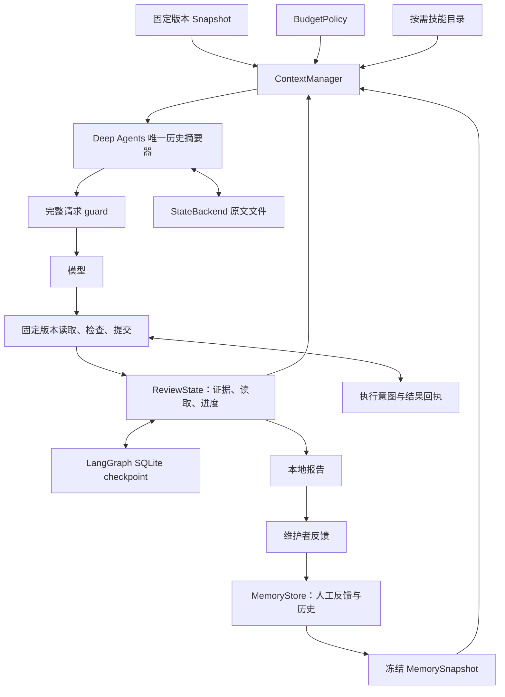

# 上下文与记忆统一设计及实现

初版日期：2026-10-02；2026-10-03 更新运行中按文件召回及主审查/核验代码片段索引。原有 86 项测试为统一改造前基线；已落地 A–D，E 已有可运行的四组实验入口。工程验收见 [VALIDATION.md](VALIDATION.md)。已有真实 PR 开发/封存数据与首轮模型运行；独立人工质量复核和重复实验仍待完成。

本项目依赖 Deep Agents **0.7.21**、LangGraph SQLite checkpointer **3.1.1**；行为以 `uv.lock` 安装源码为准。**Deep Agents/LangGraph 是唯一运行主线，SQLite 保存本地持久数据。** Letta、Mem0、OpenHands 只提供机制参考，没有作为额外运行框架接入。

## 参考与归属

| 参考 | 核对的机制 | 采用方式 |
|---|---|---|
| [Deep Agents 上下文说明](https://www.langchain.com/blog/context-management-for-deepagents)与 `middleware/summarization.py` | 大结果外置、历史压缩、恢复原始历史 | 直接复用同一个 SDK 摘要组件；薄适配覆写输入预算 hook，真实图测试压缩与文件恢复 |
| [LangGraph persistence](https://docs.langchain.com/oss/python/langgraph/persistence) | 运行 checkpoint 与长期 store 分工 | 图状态用 SqliteSaver；跨 PR 人工反馈用 MemoryStore |
| [Letta memory blocks](https://docs.letta.com/v1-sdk/memory/memory-blocks) | 有名称、用途和上限的常驻块；read-only | 借鉴分层和每轮可见性；有限事实状态与只读人工记忆 |
| [OpenHands condenser 示例](https://github.com/OpenHands/software-agent-sdk/blob/main/examples/01_standalone_sdk/14_context_condenser.py) | 压缩配置与 Conversation 持久化是不同职责 | 对照职责，不引入第二套压缩器或 Conversation 框架 |
| [Mem0 memory 源码](https://github.com/mem0ai/mem0/blob/main/mem0/memory/main.py) | 更新/删除历史与 history 查询 | 借鉴反馈生命周期；自行实现 SQLite 修订、撤销和替换链 |

没有复制 Letta/OpenHands/Mem0 实现代码，没有增加向量检索或自动规则抽取。SQLite schema、反馈关联/范围/主题分组、PR 版本与证据状态由本项目实现。AST 关联仍是静态启发式。外部 main 分支可能变化；Letta 链接是其 V1 SDK 机制说明，不代表本项目接入该 SDK。

## 一条装配路径



ContextManager 替换 SDK 的 SummarizationMiddleware 槽位，先注入工作状态和冻结反馈，再调用原生摘要，最后核对完整请求。SkillsMiddleware 的目录注入在它外层，因此也计入。没有额外 MemoryMiddleware 在 guard 之后追加输入。固定 SHA 的代码需要时通过业务工具重读；摘要不是代码原文或业务事实。

独立核验是可选第二阶段，使用同一 BudgetPolicy、摘要组件、FragmentIndex 与完整请求 guard；两阶段分别保存来源、实际输入与图状态，共享全局尝试次数。核验源码引用从自己的候选 packet 与读取回执重建，不继承主阶段的读取轨迹或人工反馈。

## 模块边界

| 模块 | 职责 |
|---|---|
| `snapshot.py` / `context.py` | 固定 SHA、merge base、差异行、受限 AST 相关材料选择 |
| `budget.py` | 单一预算配置、窗口来源、完整输入估计与限额 |
| `context_manager.py` | 材料装配、注入、原生压缩适配、最终 guard、展示清单 |
| `context_fragments.py` | 初始/读取/搜索代码的统一位置索引、静态符号关联、摘要后字面代码输入记录 |
| `state.py` / `review_state.py` | 可保存事实、序号合并、工具事务和回执重放 |
| `persistence.py` | 运行身份、不可变 artifacts、锁、执行回执与累计用量 |
| `working_context.py` | 从真实工具事实渲染有限工作状态，不存模型猜测 |
| `memory.py` | 人工反馈、范围/期限、修订撤销、来源关联与冻结召回 |
| `runtime.py` / `verification.py` | 图装配、主阶段/核验阶段恢复和报告生成 |
| `benchmark.py` / `evaluation.py` | 固定版本四组消融、位置诊断与人工复核模板 |

ReviewSession 是执行视图；checkpoint 中的 `review_session` 是已提交事实状态。业务工具在锁内串行修改，每次返回累积状态，用 sequence reducer 合并同一批工具结果。锁保护进程内操作，run 文件锁排除跨进程同时写入；SQLite 事务负责回执预算预留。这里没有引入并行子 Agent。

## 预算与可见性

默认配置集中在 BudgetPolicy：初始材料 24,000 字符、人工记忆 4,000 字符、工作状态 6,000 字符；主阶段补充读取 40,000 字符，核验 20,000 字符。扫描文件数、单次行数、检查超时等资源上限继续由对应工具限制，不能由 token 限额替代。

窗口 `W` 取用户显式 `--window-tokens`，否则取可用 model profile，并保存来源。窗口不可确认时采用完整请求 `request_chars=120000` 字符上限，不宣称有 token 窗口保证。

```text
O = 最大输出 tokens，默认 4096
R = max(2048, ceil(W × 0.10))
I = W - O - R
F = 固定系统策略 + 可见工具 schema + 技能目录的估计占用
V = I - F
```

已知窗口时，工作状态与人工记忆各最多 `min(2000, floor(V×0.10))`，初始代码最多 `min(10000, floor(V×0.40))`；其余空间供有效历史与工具响应使用。配置的字符上限仍约束各类业务材料。默认分配是待质量实验验证的工程选择。

ChatOpenAI 适配器估计消息 token，工具 schema 另行序列化计数，并预留协议开销；其他已知窗口模型采用保守 UTF-8 字节估计。没有用字符数/4 当精确换算。最终 guard 包含实际系统消息、有效历史和全部可见 schema，报告保存计数方式、大小和限额。服务端序列化与适配器仍可能不同，因此计数是估计，不能承诺精确计费。

超限时缩减初始代码、整条人工记忆记录和旧事实条目，再交给唯一原生摘要器处理历史；结构化工作状态不从中间截断 JSON。固定策略/必要状态仍放不下时明确失败，保留可恢复状态，不发送超预算请求。摘要自己的模型请求也经过回调 guard。

主阶段默认 12 次模型/24 次工具，核验默认 24 次模型/32 次工具；全局默认 64 次模型/100 次工具。SDK 摘要、失败尝试和显式重试计入，恢复后继续累计。模型报告的 token 合并为 known_usage；无返回用量的尝试计入 unknown_usage_calls。提供方内部重试可能不暴露，不能把已知 token 当完整费用。

## 保存什么

| 对象 | 内容与位置 |
|---|---|
| RunManifest | repo_id、base/merge-base/head SHA、模型配置、预算、策略、技能/实现摘要和执行环境；文件与图 state |
| ContextManifest | 内容来源/路径/选入理由、SHA/材料 hash、截断、省略、每次完整请求占用和实际记忆展示；图 state 与报告 |
| ReviewState | 原始消息、StateBackend 文件、事实状态、提交修复状态、run identity、冻结记忆与装配记录；checkpoint |
| MemorySnapshot | 启动召回原文及有界冻结候选版本；记录 ID、UID、source/scope/类型、hash 与省略数；不可变 artifacts 与 checkpoint |
| FeedbackRecord | source_run_id、finding_id、rule_key、反馈、范围、有效期、状态、替换关系；MemoryStore |
| ExecutionReceipt | 工具/模型尝试身份、stage、started/completed 状态、结果或未知用量；独立 SQLite |

读取轨迹区分请求范围和实际完整返回范围；部分最后一行不算完整覆盖。初始材料、代码读取与搜索命中使用同一片段索引算法，记录固定版本、文件、行范围、完整性、静态符号关联与原始来源；主阶段与核验分别在原生摘要后的最终 guard 记录本次字面代码输入。预算裁剪的提示文字不计入原始材料前缀。工作状态只保留有限引用，不等同于原文展示。原始材料仍在 artifacts/trace，索引由固定输入与回执重建。详细设计与边界见 [CONTEXT_FRAGMENTS.md](CONTEXT_FRAGMENTS.md)。

证据 ID 在保存状态中恢复，CheckRunner 缓存从已完成证据重建，不会因重启重新编号。finding ID 根据 run_id 与规范化内容生成，可供人工反馈关联。

本地仓库身份仍按 Git common-dir 路径生成。GitHub 模式提供 `repository_identity=github:<数字仓库 ID>`，使独立克隆可以共享人工反馈；`memory --pr` 使用同一身份，现有本地身份的记忆不会自动迁移。

## 恢复与中断边界

CLI 默认保存 `.pr-harness/runs/<run_id>/`；Python API 通过 `runs_dir` 启用持久化，未设置时保持 run-local 模式。`resume` 恢复主审查，`verify` 启动/恢复核验。恢复校验 repo、SHA、预算、模型身份、技能/实现摘要、运行环境和 artifacts hash；不兼容需新 run。

文件工具和模型摘要写文件先缓存在本步骤事务内，随成功结果的 Command 一起发布；工具文件变更也进入执行回执。这样异常不会留下让图误判步骤已完成的部分文件写入。此适配覆写锁定 SDK 的 StateBackend 内部 hooks，升级时必须重跑中断与压缩测试。

消息和文件由 SDK 的 DeltaChannel 增量存储，通过图接口重建。文件不能仅从 SQLite checkpoint 的 channel_values 字典检查，否则会漏看增量历史。测试实际触发原生压缩并重新装配图，验证原文文件、证据与记忆保留。

执行意图在调用前写入，结果回执在图状态提交前保存：

- 回执 completed：重放原始工具结果并恢复事实，不重复检查。
- started 且没有完整结果：`execution_unknown`，需显式 `--retry-unknown` 重新执行。
- 已完成图：恢复报告，不新增模型或工具尝试。

不保证模型/测试恰好执行一次；外部执行与本地持久提交之间仍有中断窗口。报告与 artifacts 用临时文件、fsync 和原子替换避免半份 JSON。run 锁目前使用 POSIX fcntl，面向 macOS/Linux；Windows 需要替换锁实现。可选 Docker 测试已经加入，镜像 ID、平台与执行限制纳入恢复身份，见[执行指南](EXECUTION_AND_AUTOMATION.md)。

## 人工反馈记忆闭环

```text
审查 finding → 维护者明确反馈 → feedback 命令关联 run/finding
→ 下一 PR 冻结本仓库有效候选 → 按改动路径/实际文件活动召回 → 模型核对当前代码
```

`accepted` 保存明确规则/经验；`dismissed` 只保存曾被驳回的建议，不能推导业务许可。Agent 无数据库写工具，也不能编辑/删除 `/memories` 下的冻结反馈。`revise` 原子新增替代记录并保留替换链；`revoke` 保留历史但停止未来召回。旧数据库增列迁移，历史不删除。

召回按 active、未过期、仓库与路径过滤；范围相关记录先于全仓库，同组按时间排序。排序不裁决正确性。同 `rule_key` 有多条适用记录时返回主题组，标为“同主题未决，非已证明矛盾”；不带 key 的记录标记未做主题检测。没有自然语言矛盾识别或自动冲突解决。

CLI 与 benchmark 使用 `freeze_snapshot`：候选容量最多 1,000 条、记录 JSON 最多 1 MB；运行中按成功代码读取及搜索实际命中重新匹配，无需重读数据库。每次请求仍只注入记忆/完整请求预算内的记录。`recall_snapshot` 与字符串 API 保持静态行为。规则来源与容量/请求预算省略分开追踪，详见[按文件召回](DYNAMIC_MEMORY.md)。

修订/撤销影响后续 run；恢复仍使用创建时冻结候选，从持久工具轨迹重建激活路径。报告区分启动时召回、请求内选中和实际展示的记录。模型分析不会自动变成长期已确认规则；语义检索、自动抽取和自进化暂未加入。

## A–E 落地状态

| 阶段 | 状态 | 验收 |
|---|---|---|
| A：结构收敛 | 已实现 | BudgetPolicy、ContextManager、来源与完整请求清单；旧命令兼容 |
| B：完整输入预算 | 已实现估计模式 | 小窗口拒绝、技能/记忆/schema 计入、实际 SDK 压缩、摘要尝试计数 |
| C：持久恢复 | 已实现 | 独立进程恢复、冻结记忆、完成检查复用、回执重放、未知执行、变更身份拒绝 |
| D：反馈关联 | 已实现 | run/finding 来源、主题分组、修订撤销、旧库迁移及冻结输入 |
| E：业务收益 | 实验入口已实现，质量未测 | baseline/working/memory/both 四组；标签在所有运行之后读取，生成人工根因复核模板 |

`benchmark` 固定 SHA、模型、工具和预算，变更工作状态/记忆开关，保存失败、用量、位置候选指标和空白人工判断。历史反馈需要显式声明，但声明本身无法证明无泄漏，仍需人工审查数据来源。脚本模型只验收链路，不能用于模型质量结论。

在 Python PR Review 范围内，A–D 构成上下文与人工反馈记忆闭环。真实长 PR 的质量、成本、记忆迁移收益需要 E 的模型运行与人工标注。手动 GitHub 链路已完成联调，见 [第一阶段](LANDING_V1.md)；Docker 执行与自动事件入口见[第二阶段](LANDING_V2.md)。本仓库[云端手动预览与 Draft 跳过](CLOUD_ACCEPTANCE.md)、[PharosRAG 部署及非 Draft 自动审查预览](PHAROS_CLOUD_ACCEPTANCE.md)已验收；已验收[版本化反馈的跨 job 读取](CLOUD_MEMORY.md)。[增量调度与语法缓存](INCREMENTAL_REVIEW.md)已在本机实现，[云端 checkpoint 保存与恢复](CLOUD_RECOVERY.md)已在预览模式验收；后续[跨 job 语法缓存](CLOUD_SYNTAX_CACHE.md)已验收；增量调度基线仍仅保存在本机。
