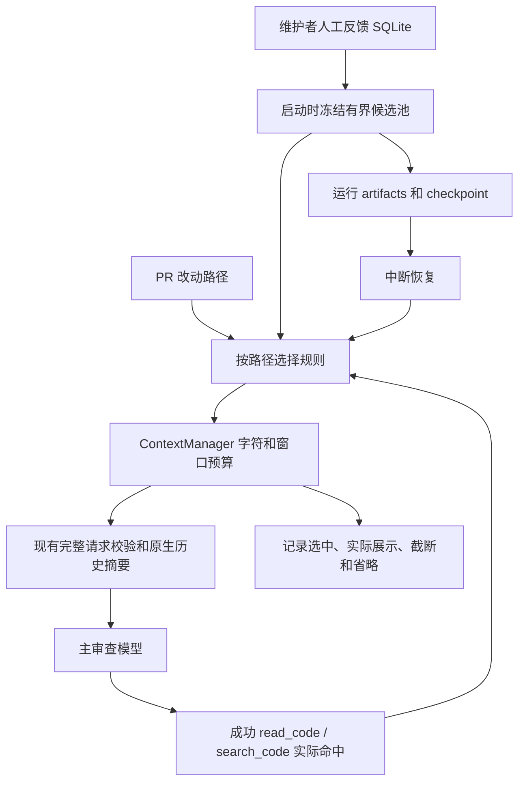

# 审查过程中按文件召回人工反馈

## 为什么增加这一层

旧流程只在启动时根据 PR 改动路径召回一次。审查继续读到调用方或测试文件时，其适用规则可能还在数据库中，却没有进入模型输入。

现在 CLI 与 benchmark 使用 `MemoryStore.freeze_snapshot()`：启动时冻结本仓库有效反馈候选，模型每次请求前，从同一候选池根据文件活动重新选择规则。继续使用现有 SQLite、ContextManager、BudgetPolicy 和 Deep Agents 摘要组件。

## 运行流程



### 1. 冻结版本

- 仅冻结本仓库 `active`、启动时未过期的人工反馈，保持 accepted/dismissed 的原始含义。
- 单个 SQLite 读事务同时读取候选及来源，避免规则和来源取自不同版本。
- 候选池最多 1,000 条，记录列表的 UTF-8 JSON 最多 1,000,000 字节；这项容量与每次模型请求的记忆预算不同。
- 候选保留顺序：匹配初始改动路径的范围规则、全仓库规则、其余范围规则；每组按时间从新到旧。超出容量的规则不进入本次运行，记录省略数。
- 候选池保存完整反馈版本和来源，不将全文追加到提示词，也不放进虚拟记忆文件。

冻结只固定本次输入，不裁决哪条规则正确。开始后的修订、撤销及过期影响新的 run；正在运行或恢复的旧 run 继续使用原候选版本。需要采用新反馈时，应开始新 run。

### 2. 按文件活动选择

启动时激活 PR 改动路径；随后读取已提交工具事实：

| 工具结果 | 是否激活对应路径 |
| --- | --- |
| `read_code` 成功返回非空代码 | 是，head/base 均可 |
| `read_code` 返回错误或空内容 | 否 |
| `read_code` 部分返回内容 | 是，但代码覆盖仍是部分，不能视作完整读取 |
| `search_code` 返回非空匹配行 | 是，只激活实际返回的命中路径 |
| 搜索预算耗尽或没有命中 | 否 |
| `list_code_files` 返回文件名 | 否，列出不等于读取代码 |
| 虚拟 `read_file`、检查输出或模型猜测 | 不激活新的仓库路径 |

初始 AST 相关材料不会单独激活额外路径；当前触发范围为 PR 改动路径与上述实际工具结果。这样不会把裁剪前的初始材料清单当作模型已完整看见的内容。

每条反馈记录只出现一次。最近读取或命中的文件规则优先，其次为较早活动与改动路径规则，最后全仓库规则；同一优先级保持冻结候选顺序。新文件规则可能在预算内替换之前展示的规则，省略会记录下来。

路径匹配沿用原有 POSIX glob，包括 `**` 跨目录匹配。无需新模型调用、向量服务或数据库查询。此版本只增加主审查阶段的反馈召回；独立核验保持原有代码/证据检查输入。

### 3. 接入原有预算

先按 `BudgetPolicy.memory_chars` 生成有限 JSON 记录文本，再按已知窗口分配的记忆空间保留完整记录，最后计入完整请求。缩短反馈文本时保留有效 JSON、ID、来源、范围及截断标记。

同 `rule_key` 的多条适用记录继续标为“同主题未决”，不按新旧自动裁决。规则未带 key 时不声称完成冲突检测。全局或规则文本中的指令仍视为建议数据，不能授权执行或写入记忆。

只读 `/memories/repository.md` 保存**启动时的选择**，说明后续规则由请求装配流程注入；不能通过读取这个文件绕过预算获取整个候选池。

## 恢复与增量调度

候选池及摘要纳入原有 memory artifact 和 checkpoint。恢复校验运行身份、artifact 摘要及候选池的仓库、容量、记录身份和内容摘要；从持久工具轨迹重新计算激活路径，无需重新打开记忆数据库。

已完成的读取回执仍按原有机制恢复，不重复执行。完成 run 的再次恢复不调用模型。来源与稳定 UID 随记录保留，本地数字 ID 只用于本数据库/运行的追踪。

增量调度的配置摘要覆盖整个候选池：即使修改的是启动时尚未展示的调用方规则，也使新 run 回退完整调度。重复冻结同样的规则，不会仅因 `captured_at` 改变而破坏复用。

## 如何查看报告

| 字段 | 解释 |
| --- | --- |
| `context.memory_snapshot.text` | 启动时按改动路径召回的原文 |
| `context.memory_snapshot.candidate_pool` | 本次冻结的候选版本、容量与省略数 |
| `context.assembly.memory_recall` | 召回模式、候选摘要和已激活路径 |
| `context.assembly.requests[].memory_recall.records` | 该请求字符预算内选中的记录及原因 |
| `...memory_recall.omitted_count` | 路径匹配后因字符预算省略的条数 |
| `...memory_recall.display_omitted_count` | 又因请求窗口空间省略的条数 |
| `...memory_recall.displayed_records` | 实际展示的 ID、UID、范围、来源、命中路径和原因 |
| `...memory_display_text` / `memory_record_ids` | 实际展示给主审查模型的文本和记录 ID |

`candidate_pool_omitted_count` 表示冻结容量不足，与请求预算省略分开记录。被容量省略的记录已不在候选池，不能再判断其是否匹配后续文件。

## Python API 与兼容

```python
policy = BudgetPolicy()
memory = MemoryStore(Path(".pr-harness/memory.sqlite3")).freeze_snapshot(
    snapshot.repo_id,
    [item.path for item in snapshot.changed_files],
    policy.memory_chars,
)
report = review(snapshot, model, memory=memory, budget=policy,
                runs_dir=Path(".pr-harness/runs"), run_id="scoped-review-01")
```

CLI `review`、`github-review`、`github-ci`、`demo` 默认采用此流程，`--no-memory` 仍关闭人工反馈。benchmark 的 memory/both 共享同一个冻结候选，baseline/working 不注入记忆。

旧 `recall_snapshot()`、`recall()` 与传入字符串的 API 继续提供静态召回，适用于显式固定材料的调用。学习新机制时，请使用 `freeze_snapshot()`。

## 源码学习与验收

按以下顺序阅读：

1. `memory.py:freeze_snapshot`：有效期、仓库和一致性事务。
2. `memory_recall.py:freeze_feedback`：有界候选与版本摘要；`select_frozen`：动态范围匹配和预算。
3. `context_manager.py:_memory_paths`：只从真实返回内容激活路径；`wrap_model_call`：装配与展示清单。
4. `runtime.py`：冻结候选保存、恢复校验、虚拟文件与报告。
5. `tests/test_dynamic_memory.py`：真实图调用、读取失败/列表、搜索、冻结生命周期、数据库删除后恢复、容量/窗口预算、增量失效及原生历史压缩。

2026-10-03 验收：**250 项完整测试通过，包含 Docker；其中动态记忆专项 10 项**。Ruff 与修改文件格式检查通过。

真实 DeepSeek 在 PharosRAG PR #5 上完成主审查与独立核验：确认的演示规则出现在全部 4 次主审查请求中，1 条 P2 定位第 6 行，核验 supported；7 次模型、10 次工具尝试。仅生成本地报告，业务仓库工作流没有更新。这例只有一条已适用规则，不能用于证明新相关文件规则的运行中激活；后者由真实图专项测试覆盖。

运行 `uv run pytest -q tests/test_dynamic_memory.py` 可重跑工程用例。测试使用预设调用器，仅证明机制正确。真实模型运行摘要见 [验收记录](validation/dynamic-memory-20261003.json)。尚无反馈记忆提升审查准确率或降低成本的结论；片段统一索引和语义冲突管理仍是后续工作。
