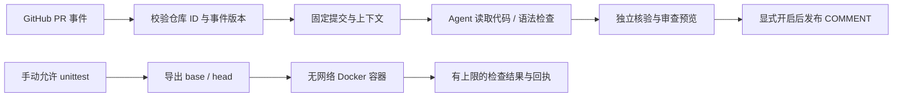

# 执行隔离与 GitHub 自动审查

更新时间：2026-10-03。源码与本机验证已完成；GitHub 云端工作流还没有启用。

## 1. 两条执行路径



GitHub 自动流程拿着模型和 GitHub 凭据，只读取提交对象、执行不运行仓库代码的语法检查。手动 `github-review --run-tests` 则把指定 unittest 文件放进 Docker 执行。两条路径共享上下文、预算、报告和版本校验。

这是项目的具体边界：自动流程没有执行 PR 的安装脚本、测试、Git hooks 或应用入口。GitHub 官方说明 `pull_request_target` 使用可信默认分支上下文，并提醒避免在这个有凭据的事件中运行 PR 代码。[GitHub 事件说明](https://docs.github.com/en/actions/reference/workflows-and-actions/events-that-trigger-workflows#pull_request_target)

## 2. 启用容器测试

在本机先启动 Docker 并预拉取受信任镜像：

```bash
docker pull python:3.12-slim
uv run pr-harness demo --test-backend docker --verify \
  --out outputs/docker-learning
```

审查实际 GitHub PR 时：

```bash
uv run --env-file .env pr-harness github-review \
  --pr https://github.com/OWNER/REPO/pull/123 \
  --model deepseek-flash --base-url https://api.deepseek.com \
  --thinking-mode disabled --run-tests \
  --test-backend docker --test-image python:3.12-slim \
  --test-timeout 20 --test-memory-mb 256 --test-cpus 1 --test-pids 64 \
  --out outputs/docker-review
```

添加 `--run-tests` 只是允许模型选择已有 unittest 文件，不保证每次都会选择。没有测试、缺依赖、导入失败、断言失败和超时分别记录，不能用“检查无法执行”代替“发现回归”。

| 入口 | 默认行为 |
| --- | --- |
| `review`、`github-review` | 仅语法检查；显式允许测试后默认 Docker |
| `review --run-tests --test-backend local` | 对明确受信任的本地代码使用原本的本机执行 |
| `github-review --run-tests --test-backend local` | 拒绝，发生在远程获取之前 |
| `github-ci` | 仅语法检查，拒绝 `--run-tests` |
| `demo` | 受信任演示默认本机执行，可选 Docker |
| Python `review()`、现有 benchmark | 为兼容已有练习默认本机；调用方需要显式传入 `ExecutionPolicy(backend="docker")` |

## 3. 容器实际限制

配置集中在 `execution.py::ExecutionPolicy`，具体容器命令在 `checks.py::_docker_unittest`。

| 限制 | 实现与作用 |
| --- | --- |
| 固定环境 | 开始调用模型前解析本地镜像 ID、架构；只用该 ID，`--pull=never`；没有镜像就报错 |
| 文件系统 | 只导出固定提交的普通文件；最多 10,000 个文件、单文件 8 MB、总量 64 MB；仅导出目录只读挂载到 `/workspace` |
| 权限 | 非 root UID/GID 匹配宿主用户，保留导出根目录 0700；root 调用者只转移导出目录给 UID/GID 65534；移除 capabilities；no-new-privileges；只读根目录；保持 Docker 默认 seccomp |
| 网络和凭据 | network=none；只传 HOME=/tmp、TMPDIR=/tmp；不挂宿主 home、源码仓库、Docker socket，不转发模型或 GitHub 密钥 |
| 资源 | 默认 256 MiB 内存与同值 memory-swap、1 CPU、64 个进程、256 个打开文件 |
| 临时写入 | `/tmp` 为 32 MiB tmpfs，noexec/nosuid/nodev；Python 关闭 pyc 写入，隔离启动环境 |
| 输出 | 持续排空管道，只保留末尾 8,000 字节；Docker log-driver=none，避免日志无限落盘 |
| 时间 | 每个版本 20 秒；可信容器 PID 1 监督测试子进程；宿主还设启动余量后的截止时间 |
| 清理 | 正常完成、超时和异常都尝试移除命名容器；宿主被强制结束后，由容器自己的截止时间结束，配合 --rm 移除 |

这些参数的运行含义可对照 [Docker 官方运行文档](https://docs.docker.com/engine/containers/run/)。本项目的验证结果来自真实容器测试，见 [第二阶段记录](LANDING_V2.md)。

`run_manifest.execution` 保存镜像 ID、平台、后端、UID/GID、时间/资源/输出上限。恢复读取保存的 ID，不重新跟随可变标签；改变限制会拒绝恢复。JSON 与 Markdown 都展示执行环境。Docker 内核/守护进程没有完整封存，不能保证跨机器的二进制环境完全一致。

容器提供进程和资源隔离，仍共享 Docker 宿主内核。当前还没有虚拟机沙箱或企业级多租户调度。宿主被强制结束可能留下有大小上限的临时导出目录，需要按本机临时文件生命周期清理。测试输出和测试本身仍属于仓库数据，不能单靠其声称一条意见必然正确。

### 仓库依赖如何处理

默认镜像只有 Python 标准库，适合现有演示和简单 unittest。不会从 PR 自动运行 pip install、构建脚本或 Dockerfile。需要依赖时，维护者先用审核过的依赖和构建材料制作可信镜像，预拉取到本机，再通过 `--test-image` 选择。每个 run 保存具体 ID。支持任意仓库环境自动构建属于后续工作。

## 4. 自动审查工作流

本项目已提供 `.github/workflows/review-pr.yml`：

1. PR opened/reopened/synchronize/ready_for_review 触发，Draft 和关闭事件跳过；手动 dispatch 可以输入本仓库 PR 编号来审查 Draft。
2. 检出默认分支事件的可信 Harness 源码，不检出 PR head；依赖按 `uv.lock` 安装。第三方 Actions 固定到完整提交 SHA。
3. `github-ci` 从事件文件解析数字仓库 ID、PR 编号、base/head；PR 标题和分支名不拼入运行命令。
4. 获取 PR 后确认事件版本；旧事件不调用模型、不发布。报告发布前再次验证远程版本。
5. 默认独立核验并保存发布预览。核验阶段失败不会发布。
6. 同一 PR 使用一个 concurrency group，新事件取消旧 job；job 最长 15 分钟；成功报告或失败诊断保存为 7 天 artifact。

默认工作流只有在仓库变量 `HARNESS_ENABLED=true` 时运行。源码仓库为 [Bin-poco/pr-review-harness](https://github.com/Bin-poco/pr-review-harness)，工作流在可信默认分支 `main`；首次云端使用需要按 [配置指南](GITHUB_SETUP.md) 设置：

| GitHub 设置 | 值 |
| --- | --- |
| Actions Secret `HARNESS_API_KEY` | 你的模型密钥 |
| Actions Variable `HARNESS_ENABLED` | `true` |
| Variable `HARNESS_MODEL` | 默认 `deepseek-flash`，可改模型 ID |
| Variable `HARNESS_BASE_URL` | 默认 `https://api.deepseek.com` |
| Variable `HARNESS_PUBLISH` | 默认 `false`；改成 `true` 才自动发送 COMMENT |

`GITHUB_TOKEN` 由 GitHub 提供，权限为 contents:read、pull-requests:write。这里写权限用于可选发布；不自动 approve、请求修改、合并 PR 或写长期记忆。开启自动发布会通知贡献者，应由仓库维护者明确配置。

本机模拟事件入口：

```bash
uv run --env-file .env pr-harness github-ci \
  --event-file /你的/事件.json --repository OWNER/REPO \
  --event-name workflow_dispatch \
  --model deepseek-flash --base-url https://api.deepseek.com \
  --thinking-mode disabled --verify --out outputs/ci-preview
```

最小手动事件的 `repository` 需要实际数字 ID，不能用任意占位 ID：

```json
{
  "repository": {"id": 123456, "full_name": "OWNER/REPO"},
  "inputs": {"pr_number": "4"}
}
```

### 接入 PharosRAG 等业务仓库

从公开 Harness 源码仓库选择已经审核过的完整 commit SHA，再生成调用方工作流：

```bash
uv run python scripts/install_workflow.py \
  --harness-repo Bin-poco/pr-review-harness \
  --harness-sha 你的40位Harness提交SHA \
  --out /你的/业务仓库/.github/workflows/pr-review.yml
```

生成器只写本地文件，拒绝覆盖现有工作流和非 SHA 引用。业务仓库的 workflow 会检出指定 Harness 仓库/提交；`GITHUB_REPOSITORY` 和事件文件仍属于业务仓库，模型审查目标不会被切换成 Harness。配置表中的 Secret/Variables 放在业务仓库。私有 Harness 仓库的跨仓库源码凭据尚未支持。

工作流须部署到业务仓库的可信默认分支才接收事件。目前 Harness 源码仓库已创建，PharosRAG 默认分支尚未部署调用方工作流，GitHub Secrets/Variables 也未配置，**尚无在线自动触发记录**。上一阶段测试 PR #4 仍是未合并的 Draft。Harness 仓库自身的工作流只能审查其自身 PR；不会直接接收 PharosRAG 的 PR 事件。

## 5. 恢复、记忆与上线边界

- 本机 Docker 运行继续使用 checkpoint/执行回执，完成后恢复不重跑已知检查。未知检查仍需要明确 `--retry-unknown`。
- GitHub hosted runner 每个 job 是新环境。当前不会自动恢复被取消的图，也不会跨 job 持久复用 SQLite 人工记忆；需要外部受控存储和调度才能实现。发布可通过远程标记查重。
- 工作流不使用模型/仓库材料构建的共享缓存；AST/记忆消融仍沿用本机评测入口。
- Actions concurrency 只限制该工作流的同一 PR；跨机器手动同时首次发布仍没有分布式锁。
- 下一步应选择一个真实仓库完成云端预览验收，再考虑增量审查、受控存储、队列与审查质量改善。

## 6. 学习与面试练习

按 `ExecutionPolicy.prepare → identity → CheckRunner → bounded_process → CheckRun → durable receipt` 追踪一个 unittest。再按 `parse_event → fetch_snapshot → validate_source → review → publish_report` 追踪一个事件。

建议亲自验证三个问题：

1. 为什么临时目录不能替代容器？分别说明文件系统、网络、凭据和资源限制。
2. 宿主被杀死时为什么不能只依赖 Python finally？容器内监督者怎样补上截止时间？
3. 为什么有 Docker 仍默认不在 pull_request_target 工作流运行 PR 测试？谁信任 Harness、依赖镜像和 PR 代码？

还应能解释：镜像标签为什么先解析成 ID、为什么恢复不跟随新标签、旧事件为什么要核对 base/head、取消旧 job 为什么不等于 exactly-once、云端 runner 为什么不能天然共享人工记忆。
