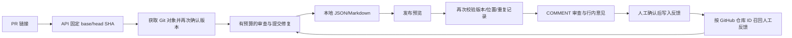

# GitHub PR 接入与发布

更新时间：2026-10-03。支持 github.com 上的 Python PR；手动联调已完成，Actions 自动入口与部署步骤见[执行与自动审查指南](EXECUTION_AND_AUTOMATION.md)。

## 1. 输入到反馈的流程



`github-review` 生成本地报告；`github-publish` 默认生成发布预览，带 `--send` 才向 GitHub 提交审查。发布类型固定为 COMMENT。

## 2. 配置模型和 GitHub 身份

在项目目录运行。模型配置沿用本机 `.env` 中的 `HARNESS_API_KEY`，通过 `uv run --env-file .env` 加载。

GitHub 身份依次读取 `HARNESS_GITHUB_TOKEN`、`GH_TOKEN`、`GITHUB_TOKEN`；均未设置时尝试已有的 `gh` 登录凭据。凭据不会保存到报告或远程 URL。

公开仓库只读获取通常不需要凭据。私有仓库获取需要相应读取权限；发布需要对目标仓库 Pull requests 的写权限。具体权限以 [GitHub 创建审查接口](https://docs.github.com/en/rest/pulls/reviews#create-a-review-for-a-pull-request)为准。把令牌保存在本机环境或被忽略的 `.env`，不要写入源码或笔记。

## 3. 先获取固定版本，不调用模型

```bash
uv run --env-file .env pr-harness github-fetch \
  --pr https://github.com/OWNER/REPO/pull/123 \
  --out outputs/github-input
```

生成 `snapshot.json` 与 `context.txt`。前者包含来源、GitHub 仓库 ID、base/head/merge base 和本地缓存路径。

获取前后分别读取 PR 信息，版本变动则拒绝继续。缓存按 GitHub 数字仓库 ID 隔离，获取提交及祖先，不使用浅克隆猜测 merge base。没有检出远程工作区或运行仓库 hooks。

链接必须是 `https://github.com/OWNER/REPO/pull/NUMBER`，不接受查询参数或片段；仓库首页地址不能直接替代 PR 地址。接口字段见 [GitHub 获取 PR 文档](https://docs.github.com/en/rest/pulls/pulls#get-a-pull-request)。

## 4. 调用模型审查

```bash
uv run --env-file .env pr-harness github-review \
  --pr https://github.com/OWNER/REPO/pull/123 \
  --model deepseek-flash --base-url https://api.deepseek.com \
  --thinking-mode disabled \
  --model-calls 12 --tool-calls 24 --submission-repairs 2 \
  --run-id github-learning-01 \
  --runs-dir outputs/github-learning/runs \
  --memory-db outputs/github-learning/memory.sqlite3 \
  --out outputs/github-learning/review
```

每次新审查使用新的 run ID；模型、预算、源码或固定版本变化时应新建 run。`resume` 可以恢复兼容的旧运行；它不会将旧输入自动更新成新的 PR 版本。

默认只允许语法检查。手动 `github-review --run-tests` 已支持 Docker 隔离执行，拒绝本机测试后端；需预拉取受信任镜像。`github-ci` 持有凭据的自动工作流仍只允许语法检查。都不会自动安装 PR 依赖，配置与限制见[执行指南](EXECUTION_AND_AUTOMATION.md)。

提交修复由 `SubmissionGuard` 控制，覆盖输出截断、无有效提交、参数解析/格式错误与位置/证据校验失败。默认最多安排两次修复，设为 0 可关闭；所有模型与工具尝试继续受阶段及全局预算限制。进入修复后只允许提交工具，不能继续调查。修复仍失败时保存 `failed.json`，不会由程序填入空意见假装成功。

## 5. 查看预览，再发布

```bash
uv run --env-file .env pr-harness github-publish \
  --report outputs/github-learning/review/review.json \
  --out outputs/github-learning/preview
```

检查 `publication.json` 的 `payload`：目标 SHA、总结、行内意见及其位置。空意见也可以生成 COMMENT 审查，它不表示仓库不存在缺陷。

确认在目标仓库进行测试发布后：

```bash
uv run --env-file .env pr-harness github-publish \
  --report outputs/github-learning/review/review.json \
  --publications-dir outputs/github-learning/publications \
  --out outputs/github-learning/publication \
  --send
```

### 发布约束

- 仅接收完成有效提交的真实模型 GitHub 报告；演示模型和失败报告不能发布。
- PR 必须仍开放，GitHub 仓库 ID、base/head SHA 必须与报告一致。
- 重新从固定快照校验 merge base、head 变更行、证据 ID，并去重意见。
- 使用 `commit_id`、`line` 和 `side=RIGHT`，当前只支持 head 中新增/修改的单行位置。
- 本地回执与锁防止同一进程目录重复发布；远程审查标记按仓库、PR、head 和 merge base 稳定生成，不受 run ID 或克隆目录影响。远程命中必须同时满足当前发布者、提交 SHA 和 COMMENTED 状态。
- 请求发出但结果未保存时，下一次先查远程标记。仍无法确认时返回 `execution_unknown`；人工核对后才使用 `--retry-unknown`。

校验和 POST 之间仍存在短暂竞态；绑定的 `commit_id` 避免意见悄悄指向另一个提交，但不保证绝对不会在旧提交留下审查。跨机器同时首次发布也不具备分布式锁，不能声称“恰好一次”。重新审查同一快照默认不会覆盖已发布审查。

## 6. 把人工确认写入同一仓库的记忆

GitHub 模式的身份来自 `github:<数字仓库 ID>` 的摘要，独立克隆可以共享反馈；本地 `--repo` 仍按 Git common-dir 路径识别。两种身份不会自动合并。

```bash
uv run --env-file .env pr-harness memory feedback \
  --pr https://github.com/OWNER/REPO/pull/123 \
  --memory-db outputs/github-learning/memory.sqlite3 \
  --report outputs/github-learning/review/review.json \
  --finding-id finding-从报告复制的ID \
  --text "维护者确认：此类输入必须覆盖空集合边界。" \
  --source "PR-123-maintainer-feedback" \
  --disposition accepted --rule-key retrieval.empty-input

uv run --env-file .env pr-harness memory list \
  --pr https://github.com/OWNER/REPO/pull/123 \
  --memory-db outputs/github-learning/memory.sqlite3
```

`add`、`list`、`feedback`、`revise`、`revoke` 都支持 `--pr`。关联反馈会核对报告仓库身份；后续审查使用同一个数据库即可召回。暂未自动读取 GitHub 讨论，也不会把模型自己的意见自动写成已确认经验。

## 7. 已验证与后续工作

当前工程测试覆盖预览无 POST、过期版本拒绝、重复发布、响应丢失后的远程对账、分页上限、意见去重、反馈身份和命令行流程。真实模型已完成公开 PR 的输入到报告链路；本次联调记录见 [落地第一阶段](LANDING_V1.md)。

后续依次补执行容器、GitHub Actions/Webhook 自动触发、队列与取消/恢复策略，再设计增量审查。审查质量和记忆收益继续依靠独立人工复核及受控实验验证。
