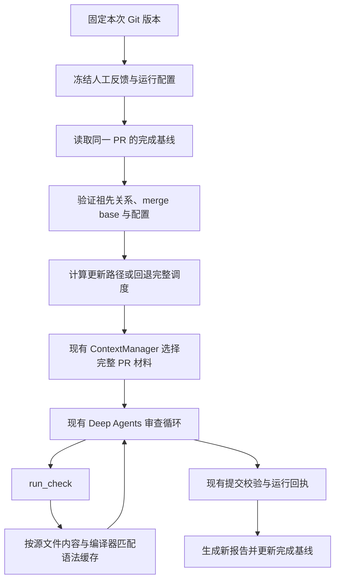

# PR 更新后的增量调度与检查缓存

## 这一版的行为

同一个 PR 被追加提交时，Harness 查询上一次**主审查正常提交结果**的 head，计算上次 head 到本次 head 的更新路径，在相同类型的材料中优先安排这些文件。模型本轮仍审查 `当前 merge base → 当前 head` 的完整 PR，位置校验也继续使用这段差异。

这使新增改动更早进入有限的上下文。旧缺陷可能保留在未更新的文件中，因此每次新运行都让模型重新判断、生成新的 finding ID。上下文的字符和文件数限制继续生效，省略的材料在 `context.omitted` 中列出；“完整 PR 范围”不表示所有代码都已装入请求。

纯 Python 语法编译结果可跨运行复用。本版单元测试和模型结论每次新运行重新产生。尚无耗时、费用或审查质量改善结论。

## 设计与现有系统的关系



复用状态由一个 `IncrementalStore` 保存，默认文件为 `.pr-harness/incremental/incremental.sqlite3`。没有增加 Agent 编排框架、检索服务或额外摘要模型。

| 状态 | 保存内容 | 生命周期 |
| --- | --- | --- |
| 完成基线 | repo ID、稳定审查标签、run ID、head、merge base、配置摘要 | 下一次同一 PR 的调度参考，最多保存 1,024 条 |
| 语法缓存 | 检查结果、来源 SHA/run ID | 相同文件内容与编译环境可复用，最多保存 4,096 条 |
| 当次运行 artifacts | 冻结的增量计划、上下文、人工反馈 | 随原有 run 保存，用于恢复和追溯 |
| 执行回执/checkpoint | 当次检查证据、消息、工具用量等 | 原有恢复机制；恢复不重新制定增量计划 |

基线只说明主审查成功提交了结果。它不表示维护者认可意见，也不表示第二轮核验成功。这里没有从基线读取历史结论。

## 何时回退完整调度

| 条件 | `incremental.reason` |
| --- | --- |
| 没有完成基线 | `no_completed_baseline` |
| 模型、预算、策略、执行设置、技能、实现或冻结记忆改变 | `configuration_changed` |
| 本次 merge base 改变 | `merge_base_changed` |
| 历史 head 不再是本次 head 的祖先，例如 force push | `previous_head_not_ancestor` |
| 历史提交不存在或更新差异超过 Snapshot 支持范围 | `previous_snapshot_unavailable` |
| head、merge base 与配置相同 | `same_snapshot_fresh_model`；模型仍重新运行 |

记忆摘要包含召回文本、来源、有效范围与记录信息；仅排除本次 `captured_at` 时间。反复召回同一组规则可以保持配置一致，撤销或改写规则会改变摘要。

语法缓存的身份独立于模型配置：`仓库身份 + 文件路径 + 源文本 SHA256 + Python 版本 + 编译优化级别 + 检查实现摘要`。模型或记忆变化会回退调度，但仍可以复用相同代码的纯编译结果。文件内容、路径、仓库或编译器发生变化就不能用旧条目。

命中的 `CheckRun.sha` 和 `version` 指向**本次**版本，`cache.origin_sha` 与 `origin_run_id` 保留原检查来源。每个版本先从固定 Git 对象读取当前文本，通过读取限制后才查询缓存。不可读、超限、非 UTF-8 等情况继续返回 unavailable，不存入缓存。

单元测试会受导入依赖、执行环境和非确定性行为影响，所以本版没有跨运行复用测试结果。相同 run 内的重复调用与完成后 resume 继续使用原有证据/回执机制。

## 使用

本地仓库使用一个稳定标签，后续更新保持标签相同，每次使用新的 run ID：

```bash
uv run --env-file .env pr-harness review \
  --repo /你的/Python仓库 --base main --head feature \
  --incremental --review-key feature-review \
  --run-id update-01 --out outputs/update-01

# 在业务仓库追加提交后，保持 review-key、模型、预算与规则相同。
uv run --env-file .env pr-harness review \
  --repo /你的/Python仓库 --base main --head feature \
  --incremental --review-key feature-review \
  --run-id update-02 --out outputs/update-02
```

未指定本地标签时，默认使用传入的 base/head **引用字符串**。如果每次传不同的提交 SHA，应显式设置 `--review-key`。GitHub PR 自动使用数字仓库 ID 与 PR 编号，跨 head 更新保持同一身份：

```bash
uv run --env-file .env pr-harness github-review \
  --pr https://github.com/OWNER/REPO/pull/123 \
  --incremental --github-memory --verify \
  --out outputs/pr-123
```

`--incremental-dir` 指定可信的本机存储目录。删除目录会丢失调度基线和检查缓存，后续运行重新计算。该目录由 Git 忽略；不要从贡献者的 PR 或下载的运行 artifact 导入数据库。

```bash
uv run pr-harness resume --run-id update-02 --out outputs/update-02-restored
```

命令行恢复会读取保存的标签和目录；Python API 恢复需要传回原增量设置。修改目录、标签或关闭增量模式会拒绝恢复。计划受 artifacts 摘要保护；当前基线被后续 run 更新，也不会改写旧 run 的输入。

恢复仍需保持原模型参数，例如初次使用 `--thinking-mode disabled` 时，恢复也应传入该参数；现有恢复身份校验会拒绝模型配置变化。

新运行和缓存命中的工具调用仍计入原有预算。报告的 `incremental.check_cache` 统计本轮证据中的命中/未命中；恢复回执会保留原命中来源，因此这个数字不能解释为恢复时新访问了多少次数据库。

多个运行同时完成时，更新基线使用事务中的比较替换；较晚结束的旧运行不会覆盖已经更新的基线。报告记录 `baseline_update`。失败或尚未提交结果的运行不会成为新基线。

## 源码学习与验证

按 `runtime.review → configuration_digest → IncrementalStore.plan → ContextManager.select → CheckRunner._run_version → IncrementalStore.complete` 阅读，然后对照 [风险测试](../tests/test_incremental.py)：

```bash
uv run pytest tests/test_incremental.py -q
```

测试使用受控 Git 提交和预设工具调用器，覆盖更新排序、保留旧 PR 变更、代码修复后清除旧意见、语法缓存版本重绑定、配置/规则失效、force push、merge base 变化、并发完成、失败恢复、命令行接入和依赖更新后的测试重跑。它证明工程行为，不衡量模型审查准确率。

**练习**：给 `z_module.py` 追加提交，对照两轮报告中的 `updated_paths`、上下文顺序、`head.sha` 与 `cache.origin_sha`。再修复 `pricing.py`，解释为何旧 finding 不再出现。最后撤销一条规则，观察调度回退原因。

## 2026-10-03 验收

代码版本：[5073307](https://github.com/Bin-poco/pr-review-harness/commit/5073307e90a44b0a724e132fbdc0b352788945d2)。本机全套测试 **240 项通过，92.21 秒**，其中增量风险测试 24 项；Docker 测试开启。源码、测试与脚本的 Ruff 检查和改动文件格式检查通过。

使用 DeepSeek 官方 `deepseek-flash`、关闭思考模式，在本机连续审查 [PharosRAG PR #5](https://github.com/Bin-poco/PharosRAG/pull/5)。两次固定相同 head `80eb69da95f03d3e84a2b3905b887180269110ed`，分别创建新的 run，复用同一增量目录和人工反馈数据库：

| 运行 | 调度 | 语法缓存命中 / 未命中 | 主审查意见 | 独立核验 |
| --- | --- | --- | --- | --- |
| `incremental-pharos-01` | 首次完整调度 | 0 / 1 | 第 6 行空输入除零，1 条 P2 | 支持 |
| `incremental-pharos-02` | 相同快照，重新审查 | 1 / 0 | 同一位置重新生成意见，finding ID 不同 | 支持 |

两轮分别有 7 次模型尝试、10 次工具尝试（包含核验），均加载同一条维护者确认规则。演示文件在 merge base 不存在，因此 base 检查为 unavailable，只有 head 的纯语法结果可缓存。没有发布 GitHub 评论。

本次真实联调验证了相同快照的缓存复用和新模型审查；追加提交、修复、force push、配置失效等行为由受控 Git 测试覆盖。真实案例没有改变 PR head，也没有进行模型质量评测。缓存命中不意味着减少了模型调用或 token。

可分享的版本、身份、工具轨迹与用量摘要保存在[验收记录](validation/incremental-20261003.json)。本机完整报告位于 `outputs/incremental/pharos-01/` 和 `outputs/incremental/pharos-02/`，由 Git 忽略。

## 云端范围

默认 Actions 工作流尚未开启此选项，也没有在独立托管 runner 之间共享基线/缓存。当前验收覆盖持续使用同一本机目录的多次运行。跨 job 复用需要额外设计可信生产者身份、版本校验、大小限制与保留策略；此前已验收的跨 job 人工记忆读取是另一条独立能力。

以上保留本机增量版本的历史验收范围。后续[云端语法缓存](CLOUD_SYNTAX_CACHE.md)已加入独立开关与可信 JSON 传输；仅共享编译结果，不共享这里的调度基线，也不导入下载的 SQLite 数据库。
