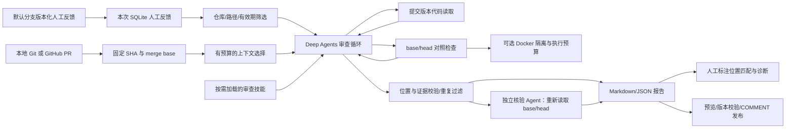

# 项目定位与开发范围

## 业务方向

维护者需要审查贡献者提交的 PR。项目尝试自动分析代码变更、查询相关代码与仓库约定、执行检查，再输出带位置和证据的审查建议。期望减少重复检查，提升审查标准的一致性；这些业务效果需要后续实验验证。

项目暂名 **PR Review Harness**，简历可描述为“基于 Deep Agents 的仓库感知 PR 审查系统”。

## 当前架构

Deep Agents 提供通用运行、上下文摘要、工具结果落盘、记忆及技能加载等能力。我们实现业务输入、AST 相关上下文选择、版本对照检查、反馈筛选、独立核验和报告校验。模型与工具的循环继续依赖 LangChain/LangGraph。

当前装配入口是 **ContextManager + BudgetPolicy**。MemoryStore 先按仓库/路径/期限召回人工反馈，生成冻结快照；ContextManager 将它和 ReviewState 的可验证事实注入，再交给同一个 SDK 摘要器压缩历史，最后校验完整请求。没有再叠加 Letta、Mem0 或其他运行框架。

`IncrementalStore` 为同一 PR 保存完成基线；在祖先关系、merge base 和配置一致时，将更新路径传给现有上下文选择器。纯语法检查按源码内容与编译器复用，保留本次 SHA 和原检查来源；模型结论和跨运行单元测试重新产生。计划随 run 冻结并进入原有恢复校验。详见[增量调度与缓存](INCREMENTAL_REVIEW.md)，云端跨 job 共享待实现。

LangGraph SQLite checkpoint 保存消息、StateBackend 文件及 ReviewState。ReviewSession 只是工具执行时的视图，工具事务返回累积 state 并按序号合并；执行回执独立保存意图、结果与全局用量，补足“执行完成但图状态还未提交”的中断窗口。人工记忆、运行 checkpoint、执行回执各自有清楚的生命周期。新增[版本化反馈文件](CLOUD_MEMORY.md)供独立云端 job 读取，报告追溯文件提交与稳定 UID，两次独立云端读取已验收；checkpoint 仍不跨 job 恢复。详见 [统一设计与实现边界](CONTEXT_MEMORY_DESIGN.md)。

`SubmissionGuard` 保存提交修复状态，识别截断、缺失提交与无效参数/位置，按剩余预算限次要求重新提交。`github.py` 提供固定版本获取、发布预览、COMMENT 和重复记录检查；GitHub 人工反馈按数字仓库 ID 共享。见 [接入指南](GITHUB_INTEGRATION.md)和[本次运行记录](LANDING_V1.md)。

`ExecutionPolicy` 固定容器镜像和资源/时间/输出限制，纳入恢复身份。`automation.py` 校验事件仓库与版本；Actions 工作流从可信源码运行，仅语法检查，默认预览。Docker 验证和本机真实事件联调已完成，见[第二阶段](LANDING_V2.md)；本仓库[云端手动预览](CLOUD_ACCEPTANCE.md)与 [PharosRAG 部署及非 Draft 自动预览](PHAROS_CLOUD_ACCEPTANCE.md)也已验收。

## 有意义的改造目标

| 迭代 | 要改的能力 | 可验收结果 |
|---|---|---|
| 0：已完成 | 版本输入、工具循环、代码/测试证据、反馈存储 | 离线工具循环样例和风险测试通过 |
| 1：已实现机制 | AST 符号关联、按需技能、独立核验、本地评估器 | 离线与边界测试通过；尚无真实模型质量结论 |
| 2：已实现机制 | 统一请求预算、持久恢复、反馈关联和四组消融入口 | 工程测试和离线实验可重跑；真实质量未测量 |
| 3：进行中 | 真实模型接入、错误分析、策略消融 | 已完成 3 个开发 PR 与 18 个跨仓库 PR 首轮，故障重放完成；还需独立人类复核和重复实验 |
| 3.1：已实现 | 结构化提交修复与诊断 | 预算/修复耗尽仍明确失败；两例真实截断后完成修复提交 |
| 4 | 记忆策略：可迁移经验、矛盾/过期记录、反馈撤销 | 历史 PR → 后续 PR 序列，排除答案泄漏，比较开关记忆 |
| 5：业务仓库自动预览已验收 | GitHub 手动链路、事件入口、默认预览工作流、容器执行 | Draft PR 真实发布/查重；Docker 隔离验证；云端手动预览、Draft 跳过与 PharosRAG 非 Draft 自动预览已验收 |
| 5.1：已验收 | 版本化人工反馈的跨 job 读取 | 两次独立 hosted job 读取相同 UID/来源，并核对每次主审查请求实际展示 |
| 5.2：已验收 | 仓库/虚拟存储工具路由 | 固定版本文件列表、原生工具说明覆盖、误用纠正及可恢复回执；本机 216 项测试与真实云端预览通过，见 [设计与验证](TOOL_ROUTING.md) |
| 6：本机机制已实现 | 增量调度与纯语法缓存、评测完善 | 保留完整 PR 范围；配置与版本变化回退；风险测试可重跑，跨 job 共享和效果评测待完成 |

当前版本验证“审查、核验、评估机制可以运行”。默认示例的结论由预设调用器给出，不证明模型效果；模型效果评测计划见 EVALUATION.md。

## 质量边界

- 语法检查通过不意味着没有逻辑问题。unittest 的失败也不能自动证明一条审查意见的根因正确。
- 只有检查文件一致、merge base 通过、head 断言失败，才能说同一检查观察到版本回归；导入/执行错误、空测试、超时分开记录。测试文件更新时仅报告两个版本的检查差异。
- 当前去重仅按文件和规范化标题，不等同于完整的根因去重。
- 当前统一完整请求预算、阶段与全局尝试次数，摘要与失败调用计入、恢复继续累计。模型计数与已知 token 是估计/部分报告，不保证提供方重试费用完整；可选 Docker 测试不自动安装依赖。
- AST 调用关系是静态启发式；动态调用与变量遮蔽可能导致遗漏或误关联。
- 独立核验保留原始意见，只给出第二个模型判断。评估器按位置匹配人工标注，根因与触发条件仍需人工复核。
- 当前意见只允许定位到 head 的新增/修改行；删除行和多行范围评论后续设计。
- GitHub 发布前重新校验 base/head，绑定 commit_id，检查与发布之间仍可能更新；跨机器同时首次发布没有分布式锁。

## 简历证据

保留四类材料：自己修改的提交、模块设计与错误分析、可复现 PR 案例、基线/消融的原始结果。技术描述明确“基于 Deep Agents 开发”，将自己的改造说清楚。

完成评测后才填写提升百分比、准确率、时延或成本。当前可以记录“实现本地 PR 审查 Harness 的上下文选择、技能、核验与评估流程”，暂不能写“企业级上线”“显著降低误报”或“完成自进化系统”。
