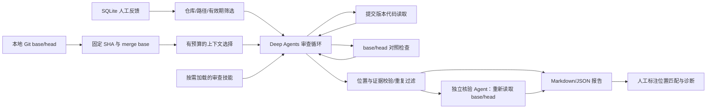

# 项目定位与开发范围

## 业务方向

维护者需要审查贡献者提交的 PR。项目尝试自动分析代码变更、查询相关代码与仓库约定、执行检查，再输出带位置和证据的审查建议。期望减少重复检查，提升审查标准的一致性；这些业务效果需要后续实验验证。

项目暂名 **PR Review Harness**，简历可描述为“基于 Deep Agents 的仓库感知 PR 审查系统”。

## 当前架构

Deep Agents 提供通用运行、上下文摘要、工具结果落盘、记忆及技能加载等能力。我们实现业务输入、AST 相关上下文选择、版本对照检查、反馈筛选、独立核验和报告校验。模型与工具的循环继续依赖 LangChain/LangGraph。

持久记忆的路径是 SQLite → 本次相关反馈 → `/memories/repository.md` → `MemoryMiddleware`。这里的 StateBackend 是本次运行的临时文件空间；SQLite 才负责跨进程保存。模型编辑临时记忆文件不会回写数据库。

## 有意义的改造目标

| 迭代 | 要改的能力 | 可验收结果 |
|---|---|---|
| 0：已完成 | 版本输入、工具循环、代码/测试证据、反馈存储 | 离线工具循环样例和风险测试通过 |
| 1：已实现机制 | AST 符号关联、按需技能、独立核验、本地评估器 | 离线与边界测试通过；尚无真实模型质量结论 |
| 2 | 真实模型接入、错误分析、策略消融 | 3–5 个开发 PR 后封存评测案例，保存轨迹与人工复核 |
| 3 | 记忆策略：可迁移经验、矛盾/过期记录、反馈撤销 | 历史 PR → 后续 PR 序列，排除答案泄漏，比较开关记忆 |
| 4 | GitHub：获取 PR、自动触发、行内评论、head 更新检查 | 当前 head 评论定位正确；重跑不产生重复评论 |
| 5 | 增量审查与缓存、评测完善 | 缓存按 SHA/模型/规则/记忆版本失效；基线和消融结果可重跑 |

当前版本验证“审查、核验、评估机制可以运行”。默认示例的结论由预设调用器给出，不证明模型效果；模型效果评测计划见 EVALUATION.md。

## 质量边界

- 语法检查通过不意味着没有逻辑问题。unittest 的失败也不能自动证明一条审查意见的根因正确。
- 只有检查文件一致、merge base 通过、head 断言失败，才能说同一检查观察到版本回归；导入/执行错误、空测试、超时分开记录。测试文件更新时仅报告两个版本的检查差异。
- 当前去重仅按文件和规范化标题，不等同于完整的根因去重。
- 当前分别限制审查与核验主循环调用次数和输出读取量，token 仅统计各阶段可见消息；还没有包含内部摘要/重试的全局费用预算、运行恢复或容器隔离。
- AST 调用关系是静态启发式；动态调用与变量遮蔽可能导致遗漏或误关联。
- 独立核验保留原始意见，只给出第二个模型判断。评估器按位置匹配人工标注，根因与触发条件仍需人工复核。
- 当前意见只允许定位到 head 的新增/修改行；删除行和多行范围评论后续设计。
- 自动发布到 GitHub 时，还需要重新确认 PR head 未更新；本版仅生成绑定 SHA 的本地报告。

## 简历证据

保留四类材料：自己修改的提交、模块设计与错误分析、可复现 PR 案例、基线/消融的原始结果。技术描述明确“基于 Deep Agents 开发”，将自己的改造说清楚。

完成评测后才填写提升百分比、准确率、时延或成本。当前可以记录“实现本地 PR 审查 Harness 的上下文选择、技能、核验与评估流程”，暂不能写“企业级上线”“显著降低误报”或“完成自进化系统”。
