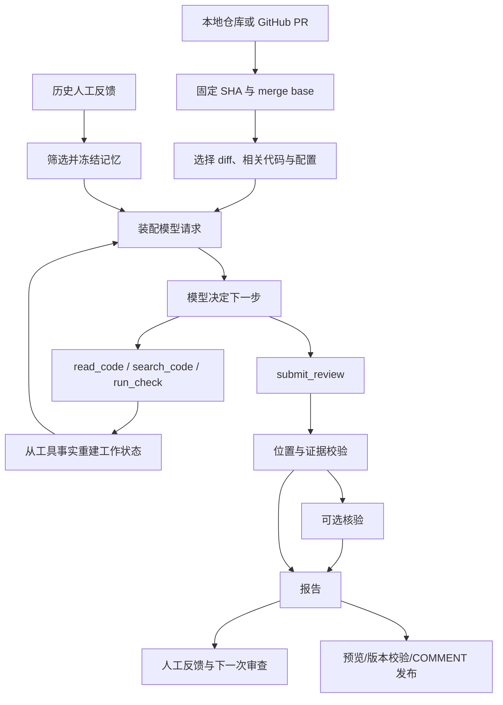

# PR Review Harness 学习讲义

更新时间：2026-10-03。以当前仓库源码为准。

适合已经学过 Agent 工具循环和 RAG、准备把本项目作为个人简历项目的人。学习目标是能沿着一次运行解释源码、复现关键行为，并独立完成下一项改造。

文中命令均在克隆后的 `pr-review-harness/` 项目根目录执行。

## 使用方法

先完成第 1 节的离线演示，再按源码路线阅读。每次学习留下三样东西：一张自己画的流程图、一份实际输出、一段用自己的话写的设计解释。读不懂底座时，先回到本项目的输入、输出和测试，确定问题发生在哪一层。

| 次序 | 学习主题 | 建议用时 | 本次产出 |
| --- | --- | --- | --- |
| 1 | 运行演示，理解业务流程 | 45–60 分钟 | 解释一条审查意见的来源 |
| 2 | 固定版本、merge base、变更行 | 60 分钟 | 画出分支与比较起点 |
| 3 | 模型与工具循环、提交校验 | 60–90 分钟 | 画出一次调用的控制流 |
| 4 | 初始上下文与按需读取 | 60–90 分钟 | 对比 AST 与 imports 选入材料 |
| 5 | 完整请求预算、工作状态、摘要 | 90 分钟 | 解释压缩后哪些事实还能恢复 |
| 6 | 人工反馈记忆 | 60–90 分钟 | 完成写入、召回、修订和撤销实验 |
| 7 | checkpoint 与执行回执 | 90 分钟 | 解释中断与重复执行的处理 |
| 8 | 独立核验与审查技能 | 60 分钟 | 解释核验约束与结论边界 |
| 9 | 真实 PR 与评测 | 60–90 分钟 | 完成一份错误分析 |
| 10 | 改造任务与面试讲解 | 90 分钟以上 | 一项小改造、一份设计说明 |

新增提交可靠性、GitHub 接入、Docker 执行与自动事件入口；第 10 节给出源码路线，[GitHub 操作指南](GITHUB_INTEGRATION.md)和[执行与自动审查](EXECUTION_AND_AUTOMATION.md)提供命令与部署边界。本仓库云端手动预览与 Draft 跳过已验收，见[云端记录](CLOUD_ACCEPTANCE.md)。

可以每天完成一次，也可以把前五次作为第一周、后五次作为第二周。前置知识包括 Python 函数与类、dataclass、基本 SQL、Git 分支与提交、工具调用的请求和响应。

## 1. 先看到一条完整审查链路

### 1.1 项目解决什么问题

维护者收到一个 PR，需要判断变更是否引入新的逻辑缺陷。系统固定 PR 的代码版本，选择相关材料，让模型调用代码读取与检查工具，最后生成有位置、触发条件和证据来源的意见。

在本项目中，可以把职责分成三层：

| 层 | 负责什么 | 本项目实例 |
| --- | --- | --- |
| 模型 | 根据材料决定下一步、提出缺陷解释 | DeepSeek API；离线演示使用预设模型 |
| Harness | 约束输入、工具、预算、状态、提交与恢复 | Snapshot、ContextManager、RunStore、提交校验 |
| 业务应用 | 定义 PR 审查目标与报告形式 | 固定版本审查、双版本检查、反馈记录、Markdown/JSON 报告 |

重点掌握第二层如何让第三层可运行、可追溯。模型的判断可能错误，因此工具结果、代码版本和运行失败必须能被查清。



### 1.2 跑离线演示

下面命令使用独立练习目录，不需要 API 密钥。文档制作时已验证同一流程；重复练习时，将输出路径和 run ID 的 `01` 换成新的编号。

```bash
cd pr-review-harness
uv sync --group dev
uv run pr-harness demo --verify \
  --run-id learning-01 \
  --runs-dir outputs/learning/runs \
  --memory-db outputs/learning/memory.sqlite3 \
  --out outputs/learning/demo-01
```

演示仓库只有一个折扣计算函数。base 使用 `percent / 100`，head 改成 `percent // 100`：20% 折扣的整除结果为 0，价格 100 最终仍是 100，测试期望值为 80。

演示模型 `DemoChatModel` 和 `DemoVerifierModel` 的工具调用与结论预先编好；代码读取、Git 快照、检查执行和报告生成实际发生。这个演示适合学流程。

文档制作时保存的示例：审查报告（本机 `outputs/study-guide/demo/review.md`）、完整运行 JSON（本机 `outputs/study-guide/demo/review.json`）。

### 1.3 从输出反查源码

打开 `review.json`，按顺序找这些字段：

| 字段 | 观察内容 | 对应的问题 |
| --- | --- | --- |
| `mode` | `scripted-demo` 或 `live` | 结论由预设模型还是实际服务生成？ |
| `base_sha` / `merge_base_sha` / `head_sha` | 固定提交 | 两版代码具体是哪两个版本？ |
| `trace` | `read_code → run_check → submit_review` | 模型实际做了什么？ |
| `evidence` | 两版检查状态、`same_check` | 有没有同一检查观察到的行为差异？ |
| `findings` | 位置、触发条件、证据 ID | 意见引用了什么？ |
| `context.assembly` | 材料、请求、工作状态、摘要 | 每次调用装进了什么？ |
| `budget_usage` | 累计模型/工具尝试与已知用量 | 这次运行消耗了多少可见资源？ |
| `verification` | 第二轮读取与判断 | 核验有没有重新看两版代码？ |
| `submission` | 输出诊断、修复次数、停止原因 | 是否完成有效提交，失败怎样处理？ |
| `source` | GitHub PR、仓库 ID 和版本 | 报告来自哪个远程 PR？ |

本次验证中，离线主审查轨迹为三个工具调用；证据 `check-001` 在 base 通过、head 断言失败，`same_check=true`。加上核验，总计 6 次模型尝试、6 次工具尝试。预设模型没有服务端 token，用量会标为未知。

**自检**：根据 trace 和 evidence 解释折扣意见。如果将 head 失败原因换成缺少依赖，是否仍能认定整除造成了回归？

## 2. 固定版本：为什么先学 Snapshot

阅读 [snapshot.py](../src/pr_review_harness/snapshot.py)，从 `Snapshot.__post_init__`、`_changes`、`read_file`、`validate_location` 开始。

`base_ref` 是用户指定的目标分支或提交，`head_ref` 是待审查版本。分支名会移动，所以初始化时必须解析成 SHA。实际比较起点是 `merge_base_sha`，也就是两条历史的共同祖先。

例如，目标分支在 PR 创建后又合并了其他变更：

```text
       T1 -- T2        ← base_ref 的当前提交
      /
M ----
      \
       P1 -- P2        ← head_ref

本项目审查的差异：M → P2
base_sha：T2；merge_base_sha：M；head_sha：P2
```

如果直接拿 T2 与 P2 比较，可能把目标分支新引入的内容混入本次审查。这里 `read_code(version="base")` 读取 M。

代码从 Git blob 读取，因此工作区的未提交编辑不会改变已固定的输入。报告位置只允许指向 head 中新增或修改的行；diff hunk 中没改过的上下文行也会被拒绝。当前实现对删除行评论尚无支持。

本地 `--repo` 的 `repo_id` 来自 Git common directory 的路径摘要，同一仓库的 worktree 共享身份，独立克隆默认不同。GitHub 模式则由 `github:<数字仓库 ID>` 生成稳定身份；跨克隆的审查与 `memory --pr` 使用同一个身份。两种模式的已有记忆不会自动合并。

**练习**：阅读 [快照与上下文测试](../tests/test_snapshot_context.py) 的 `test_comparison_and_base_reads_use_merge_base`。画出它创建的分支，标出三个 SHA。

**自检**：为什么报告要绑定 SHA？PR 更新后，为什么不能使用旧运行的证据直接发表评论？

## 3. 工具循环：我们在哪一层控制 Agent

先读 [cli.py](../src/pr_review_harness/cli.py) 的 `_dispatch`，再读 [runtime.py](../src/pr_review_harness/runtime.py) 的 `review`、`_review`、`_review_tools` 和 `validate_findings`。

```text
CLI _dispatch
  → Snapshot.load
  → MemoryStore.recall_snapshot
  → BudgetPolicy
  → review / _review
      → 创建 SubmissionGuard、ContextManager、ReviewFacts、ReviewToolScope
      → create_deep_agent 注册工具与中间件
      → agent.invoke 执行图
      → 检查是否完成有效 submit_review
  → 可选 verify_report
  → write_report
```

`create_deep_agent` 是图的装配入口。模型与工具的反复执行由 LangChain/LangGraph 的 Agent 图完成。本项目提供业务工具、状态和约束。先弄清调用边界，再深入底座的循环实现。

| 工具 | 当前实现 | 学习时留意 |
| --- | --- | --- |
| `list_code_files` | 分页列出固定版本的仓库文件 | 每页最多 100 个，目录是字面量；字符预算不足不切断路径 |
| `read_code` | 读取固定版本的带行号源码 | 每次 1–160 行；预算不足会截断，记录实际返回范围 |
| `search_code` | 在 head 中做字面量检索 | 最多扫描前 200 个 Python 文件、返回 12 个匹配 |
| `run_check` | 两版语法检查；显式开启后可执行 unittest | 检查结果生成真实 evidence ID |
| `submit_review` | 提交结构化 Finding 列表 | 校验 head 变更行、已有证据 ID，按文件与规范化标题去重 |

`ls/glob/grep/read_file` 访问的是虚拟技能、记忆、笔记和卸载结果，不能访问仓库。空结果不表示仓库中没有文件。`ReviewToolScope` 对缺失的虚拟路径给出纠正提示，并将这些调用计入预算和回执。学习这个实际故障及改造见 [工具路由](TOOL_ROUTING.md)；练习解释为何不直接将 `ls /examples` 偷换成仓库查询。

有效提交空列表表示运行完成但未形成可提交意见。没有有效提交表示运行失败。这两种状态必须区分，否则会低估故障和遗漏。

意见结构见 [models.py](../src/pr_review_harness/models.py) 的 `Finding`：`path`、`line`、`severity`、`title`、`explanation`、`trigger`、`evidence_ids`、`confidence`。格式校验通过，仍不能证明意见在语义上正确。

`ReviewToolScope` 会屏蔽通用委派与执行工具，在调查窗口结束时要求提交；提交成功后结束图。`SubmissionGuard` 识别截断、无有效提交、参数与位置错误，在现有预算内安排限次修复。修复时只暴露提交工具；即使提供方仍返回其他工具调用，执行层也会阻止继续调查，尝试仍计入预算。详见第 10 节。

**练习**：读 [runtime 测试](../tests/test_runtime.py) 的 `test_finding_rejects_unchanged_locations_and_fabricated_evidence`、`test_decision_window_reserves_a_submission_call`，说明各自在防什么错误。

**自检**：模型说“我已经查完了”，为什么不能直接作为成功状态？`evidence_ids=[]` 在当前结构中允许；这和“所有意见都有可执行复现证据”有什么差别？

## 4. 检查证据：观察到差异之后还需要解释

阅读 [checks.py](../src/pr_review_harness/checks.py) 的 `CheckRunner`。

语法检查用 `compile` 检查文件是否能解析；unittest 将固定版本导出，执行指定测试文件。`review` / `github-review` 显式允许测试后默认 Docker：无网络、只读、非 root、有资源/时间/日志上限。不会自动为任意上游项目安装依赖。演示和已有评测 Python API 默认仍是受信任本机执行；真实仓库的环境需准备可信镜像。

| base | head | 可以得出的观察 |
| --- | --- | --- |
| passed | failed | 若 same_check=true，同一检查观察到行为差异；还要验证原因 |
| failed | failed | 可能是已有问题，也可能是两版不同问题，需要看输出 |
| passed | error | head 执行异常或环境出错，不能自动当成目标逻辑回归 |
| passed | passed | 这个检查没观察到差异，覆盖范围之外仍可能有缺陷 |
| unavailable / timeout | 任意 | 证据不完整，需要明确记录 |

`same_check` 对 unittest 比较两版测试文件内容。PR 同时改了测试时，两版结果差异不能直接描述为“同一测试在 base 过、head 挂”。

**练习**：读 `test_changed_tests_are_not_reported_as_same_check`，写下“新版本测试失败”和“旧版本已有的同一测试发现回归”的区别。

## 5. 上下文管理：选入什么、保留什么、何时压缩

阅读顺序：[context.py](../src/pr_review_harness/context.py) → [context_fragments.py](../src/pr_review_harness/context_fragments.py) → [context_manager.py](../src/pr_review_harness/context_manager.py) → [budget.py](../src/pr_review_harness/budget.py) → [working_context.py](../src/pr_review_harness/working_context.py)。

### 5.1 初始材料选择

`build_context` 优先放 Python 业务变更，再放测试与说明文件；加入 diff、head 变更邻域和配置，剩余预算用于相关文件。AST 策略寻找被改动的函数/类，再通过导入和调用关联选择调用方及测试。

这里是有上限的静态启发式。动态调用、别名、变量遮蔽和扫描上限都会影响覆盖。被选入不代表一定相关，被省略也不代表没有风险。选入理由和省略信息都应保留。

用自己的演示仓库查看材料，不调用模型：

```bash
uv run pr-harness context \
  --repo outputs/learning/demo-01/repo --base HEAD~1 --head HEAD \
  --strategy ast --max-chars 12000
uv run pr-harness context \
  --repo outputs/learning/demo-01/repo --base HEAD~1 --head HEAD \
  --strategy imports --max-chars 12000
```

小演示可能看不出两种策略的区别。继续阅读 `test_context_selects_changed_symbol_calls_beyond_first_160_lines` 和 `test_context_resolves_relative_import_of_changed_symbol`，观察 AST 策略具体多找到哪些代码。

### 5.2 完整请求预算

初始代码材料的字符上限只是预算的一部分。每次模型调用还会包含系统策略、技能信息、工具 schema、历史消息、工具结果、人工反馈和工作状态。

```text
完整输入 = 固定策略 + 工具/技能 + 初始材料与历史
         + 当前工具结果 + 冻结人工反馈 + 工作状态
```

默认关键参数：

| 参数 | 默认值 | 含义 |
| --- | ---: | --- |
| context_chars | 24,000 | 初始代码材料上限 |
| memory_chars | 4,000 | 人工反馈材料上限 |
| working_chars | 6,000 | 当前事实账本上限 |
| read_chars | 40,000 | 主审查累计按需读取上限 |
| verify_read_chars | 20,000 | 核验阶段读取上限 |
| request_chars | 120,000 | 未知窗口时的完整请求字符上限 |
| model_calls / tool_calls | 12 / 24 | 主审查阶段调用上限 |
| submission_repairs | 2 | 最多安排的提交修复次数；不增加模型/工具预算 |
| total_model_calls / total_tool_calls | 64 / 100 | 主审查、摘要与核验的累计上限 |
| output_tokens | 4,096 | 预留并配置的模型输出上限 |

明确知道模型窗口时，`BudgetPolicy` 留出输出与安全余量，按适配器或保守估算计数；窗口未知时采用字符模式。它不承诺精确服务端计费，也不能把“字符数除以 4”当成所有代码与中文的 token 数。

### 5.3 工作状态与历史摘要

`WorkingContext` 每轮从工具事实重建一个小账本，包含版本、已读取范围、真实检查证据 ID、剩余读取预算和省略数量。账本由程序生成，因此不会依赖模型是否把证据 ID 摘要正确。

自动历史压缩复用 Deep Agents 的摘要组件。本项目统一预算并注入账本与冻结记忆；完整历史和外置文件通过底座状态保留。账本不是全文副本，记录被省略时会明确计数。

**片段索引练习**：阅读[统一代码片段索引](CONTEXT_FRAGMENTS.md)，运行 `uv run pytest -q tests/test_context_fragments.py`。从报告的 `context.assembly.fragment_index` 找到某个读取来源，再检查 `requests[].source_fragments`。解释为什么片段仍被归档，摘要后却不一定还在这次请求中；为什么部分搜索行、分散邻域和符号关联均不能当作完整文件审查。

阅读 [持久上下文测试](../tests/test_durable_context.py) 的 `test_unified_context_survives_native_compaction_and_restores_files`。测试实际触发压缩，再重建图验证事实与原文恢复；不能仅通过“demo 没报错”证明长上下文压缩正确。

**自检**：初始材料在预算内，为什么完整请求仍可能超限？普通聊天摘要遗漏 check-001 时，系统靠什么继续提供它？

## 6. 记忆：维护者确认的经验如何进入下一次审查

阅读 [memory.py](../src/pr_review_harness/memory.py) 的 `add_feedback`、`freeze_snapshot`、`recall_snapshot`、`revise`、`revoke`，以及 [memory_recall.py](../src/pr_review_harness/memory_recall.py) 的冻结候选与按路径选择。

记忆保存跨运行可复用的人工反馈，例如接口允许的行为、已驳回的误报及维护者确认的约束。数据库记录来源、仓库、路径范围、有效期、run/finding 关联和状态。

| 概念 | 生命周期 | 当前用途 |
| --- | --- | --- |
| 本次代码上下文 | 一次审查 | 告诉模型当前 PR 改了什么 |
| 工作状态 | 一次审查，多轮刷新 | 提醒版本、读取范围与证据 |
| 人工反馈记忆 | 多次审查 | 复用确认过的仓库经验 |
| checkpoint | 一次 run 的恢复 | 延续中断前的图与消息状态 |

召回先筛仓库、active 状态、有效期和路径，再优先放路径相关记录、按新到旧排序，形成冻结快照。恢复同一 run 继续使用原快照；修改数据库只影响后续新 run。

`accepted` 是已确认的指导；`dismissed` 表示意见被驳回，需要理解驳回原因。`rule_key` 只将同主题记录聚在一起，不能证明它们矛盾，也不会自动选择一条为真。当前召回是确定性筛选，没有向量检索或自动经验提炼。

### 6.1 写入练习反馈

只写入隔离的练习数据库。以下规则来自演示测试可以确认的行为：

```bash
uv run pr-harness memory feedback \
  --repo outputs/learning/demo-01/repo \
  --report outputs/learning/demo-01/review.json \
  --memory-db outputs/learning/memory.sqlite3 \
  --scope pricing.py --rule-key discount-fraction --disposition accepted \
  --text "折扣比例需要保留小数；价格100、折扣20时结果应为80。" \
  --source "learning:demo-discount-check" --ttl-days 30
uv run pr-harness memory list \
  --repo outputs/learning/demo-01/repo \
  --memory-db outputs/learning/memory.sqlite3
```

将反馈关联到某一条意见时，可加 `--finding-id`，值从实际 review.json 复制；这里使用 run 级关联。

用同一个演示仓库建立新 run，查看召回和实际注入。代码中的 `learning-memory-01` 也只能首次使用；重复练习换编号。

```bash
uv run python - <<'PY'
from pathlib import Path
from pr_review_harness.memory import MemoryStore
from pr_review_harness.report import write_report
from pr_review_harness.runtime import DemoChatModel, review
from pr_review_harness.snapshot import Snapshot

root = Path.cwd()
snapshot = Snapshot.load(root / "outputs/learning/demo-01/repo", "HEAD~1", "HEAD")
store = MemoryStore(root / "outputs/learning/memory.sqlite3")
memory = store.freeze_snapshot(snapshot.repo_id, [f.path for f in snapshot.changed_files])
report = review(snapshot, DemoChatModel(), memory=memory, run_tests=True,
                mode="scripted-demo", runs_dir=root / "outputs/learning/runs",
                run_id="learning-memory-01")
write_report(report, root / "outputs/learning/memory-review-01")
print("recalled records:", len(memory.manifest["records"]))
print("snapshot hash:", report["context"]["memory_snapshot"]["sha256"])
PY
```

查看新报告的 `context.memory_snapshot`，再查看 `context.assembly.requests` 中的 `memory_record_ids`、`memory_display_text` 和 `memory_display_truncated`。被召回的记录还可能因完整请求预算而被缩减，因此召回记录与实际展示记录都要查看。

**运行中召回练习**：阅读[按文件召回文档](DYNAMIC_MEMORY.md)，运行 `uv run pytest -q tests/test_dynamic_memory.py`。跟踪 `read_code` 或 `search_code` 命中后的 `memory_recall.activated_paths` 与 `displayed_records`，解释为什么列文件、读失败、虚拟文件读取不会激活新仓库规则。再解释数据库删除后恢复为何仍能展示旧调用方规则，为什么新规则会影响增量配置摘要。

### 6.2 修订和撤销

从 memory list 取得真实记录 ID，分别试 `memory revise` 与 `memory revoke`，提供 `--reason`。修订创建新记录并将旧记录标为 superseded；撤销留下历史，但未来不再召回。

配合阅读 [记忆测试](../tests/test_memory.py) 的 `test_revision_and_revocation_preserve_history_and_stop_old_recall`。

**跨次云端练习**：阅读 [memory_bundle.py](../src/pr_review_harness/memory_bundle.py)，解释稳定 UID 为什么比本地数字 ID 更适合跨数据库；导出后导入另一数据库，核对修订/撤销历史。再核对 `memory-source.json`、冻结召回和各次请求的 `memory_display_text`，区分下载、召回和实际展示。默认分支的记忆 SHA 为什么可以不同于 PR base/head？

**自检**：为什么不把所有模型意见直接存进长期记忆？为什么更新记忆之后，旧 run 恢复仍看旧快照？这套系统是否已经证明记忆可以提升后续审查效果？

## 7. 中断恢复：checkpoint 为什么还需要执行回执

阅读 [state.py](../src/pr_review_harness/state.py)、[review_state.py](../src/pr_review_harness/review_state.py)、[persistence.py](../src/pr_review_harness/persistence.py)。

LangGraph checkpoint 保存图状态和消息，`ReviewState` 加入业务事实。`ReviewSession` 是工具执行时的可变视图，事实序列与图状态需要同步。累计状态按 sequence 合并，以保留批量工具执行产生的事实。

只存 checkpoint 会遇到一个中断窗口：工具已执行并返回结果，图状态还没提交，进程就退出。恢复后重跑该工具会造成重复执行。

```text
记录执行意图 → 执行工具 → 保存回执 → 提交图状态
                 ↑            ↑
          退出：结果可能未知    退出：可以复用回执
```

`RunStore` 用 executions.sqlite3 保存执行意图、状态、结果和累计调用用量。checkpoint.sqlite3 负责图状态；run.lock 防止同一 run 同时有两个活动写入者。无法确认是否完成的检查要求显式 `--retry-unknown`，不能擅自假定成功。

恢复还要核对仓库、SHA、模型、预算、技能、实现摘要、运行环境与 artifacts。输入身份改变应建立新 run。预算不会因为换进程而清零。

### 7.1 完成后恢复实验

```bash
uv run pr-harness resume \
  --run-id learning-01 --runs-dir outputs/learning/runs \
  --out outputs/learning/resumed-01
```

比较原报告和恢复报告：相同意见与证据、resumed=true、累计模型/工具尝试没有增加。这是完成后恢复实验；真正中断恢复的行为要继续看测试。

推荐阅读 `test_resume_keeps_evidence_budget_and_frozen_memory`、`test_completed_receipt_replays_without_reexecuting_tool`、`test_unknown_execution_requires_explicit_retry`、`test_file_write_receipt_restores_pending_backend_changes`。

需要验证中断窗口时，可以运行其中一个现成测试：

```bash
uv run pytest tests/test_durable_context.py::test_completed_receipt_replays_without_reexecuting_tool -q
```

**自检**：临时文件、图状态、执行回执各自解决什么问题？为何不能只打开 SQLite 的 channel_values 就认定所有消息或文件丢失？底座使用增量状态，需要通过图接口重建。

### 7.2 云端跨 job 恢复

阅读 [云端恢复设计与真实验收](CLOUD_RECOVERY.md)，对照三个运行的 `cloud-run.json`、`checkpoint-export.json`、`automation.json.restored_from` 和 `budget_usage`。源码顺序是工作流 → CLI → `cloud_state.py` → `RunStore` → LangGraph。

```bash
uv run pytest -q tests/test_cloud_state.py
```

重点跟踪 `test_cloud_model_failure_preserves_check_memory_index_and_attempts` 和 `test_cloud_verifier_receipt_replay_and_completed_recovery`：从归档恢复到同一绝对路径，删除原记忆数据库，解释为何检查不重复、已用预算不清零，核验还能接着完成。

**真实发现**：直接 Re-run 曾导致上一尝试的 artifact 消失，项目因此要求新建 Run workflow 并指定来源；不能只根据本机模拟测试宣称平台支持自动恢复。面试应能解释 SQLite backup 如何包含 WAL、为什么校验可信工作流后才加载图状态、为什么强制取消后仍可能没有可恢复归档。

## 8. 核验与技能：各自承担什么

阅读 [verification.py](../src/pr_review_harness/verification.py) 的 `_packet`、`_tools`、`verify_report`；再看 [skills.py](../src/pr_review_harness/skills.py) 与两个审查技能文件。

核验使用另一个 Agent 图，对主审查意见给出 supported、rejected 或 uncertain。它需要重新尝试读取意见对应文件的 base 和 head；确定判断还要求有效读取覆盖 head 意见位置，并有有效 base 材料或文件不存在的事实。

当前核验默认最多处理五条意见，读取范围限制在意见指定路径，能力有限；原意见会保留。第二个图通常仍使用相同模型，模型错误可能相关，不能把 supported 当成人类确认。

技能是两个短 playbook，分别关注 Python 边界回归与 API 兼容。底座提供技能目录与按需加载机制，模型通过 read_file 读取全文；它是调查清单，不是缺陷证据。技能本身不会执行工具。

**练习**：阅读 [核验测试](../tests/test_verification.py) 的 `test_truncated_or_irrelevant_reads_cannot_support_a_claim`，解释为何只读到文件开头不足以支持后面的缺陷。

核验与主阶段共用 `FragmentIndex`，但各自拥有来源与输入记录。阅读 [核验片段测试](../tests/test_verifier_fragments.py)，比较 `context.assembly.fragment_index` 和 `verification.context.fragment_index`；相同 ID 不表示两个阶段共享读取事实。核验在压缩前注入有限源码引用，最终 guard 记录仍存在的字面源码；跨进程恢复从 packet 与本阶段回执重建，不能把模型摘要当源码覆盖记录。

**自检**：主审查与核验的材料和工具有哪些区别？核验驳回一条意见后，为什么报告仍保留它？

## 9. 真实运行与评测：从工程机制走到质量证据

阅读 [evaluation.py](../src/pr_review_harness/evaluation.py)、[benchmark.py](../src/pr_review_harness/benchmark.py) 和[跨仓库首轮记录](../evaluation/independent_real_prs/FIRST_RUN.md)。

### 9.1 区分三类结果

| 结果 | 证明什么 |
| --- | --- |
| 工程测试通过 | 特定预算、校验、恢复等机制按约定运行 |
| 离线预设演示成功 | 输入到报告的链路可执行 |
| 真实模型与人工根因复核 | 在具体样本上，模型是否提出正确且有价值的意见 |

`evaluate_report` 根据固定版本的文件与行号匹配标签。自动输出的 tp/fp/fn 是位置代理计数，不能直接用作最终语义准确率：落在正确位置的解释也可能错误，其他位置的意见也可能是新发现。

`benchmark` 固定快照、模型、工具和预算，四组分别开启工作状态与反馈记忆：

| 变体 | 工作状态 | 历史反馈 |
| --- | --- | --- |
| baseline | 关闭 | 关闭 |
| working | 开启 | 关闭 |
| memory | 关闭 | 开启 |
| both | 开启 | 开启 |

baseline 仍保留同一个 Agent、初始上下文、工具和预算。memory/both 必须有真实历史反馈输入；空记忆不能用来证明记忆效果。所有审查结束后才读取 gold，并生成位置计数与空白人工判断模板。

### 9.2 当前真实证据

18 个公开 PR 来自四个仓库：8 个回归、对应 8 个修复、2 个独立功能对照。36 次双版本复现符合预期；首轮 36 次模型审查中 33 次成功提交，3 次失败。两种配置共同完成的 6 个回归案例中，各匹配到 2 个已知缺陷位置，尚无工作状态带来质量提升的证据。

复现与模型审查是两件事：复现先确认案例标签的触发条件，不能把复现答案交给模型。回归与修复共享根因，统计时按组理解；公开资料也可能被模型见过。

本轮三个失败适合做源码练习：

- 两个 Werkzeug run 的模型输出达到长度限制，没有有效调用 submit_review。
- 一个 Click run 尝试调用提交工具，但参数无法解析为有效 JSON。
- 三个原始失败保留在批次中。新增提交修复后单独重放三例，均有效提交；两例再次截断后经过修复，另一例没有复现原错误。详见[本次记录](LANDING_V1.md)，不能据此声称准确率提升。

**练习**：选一条 finding，完成“触发条件 → head 行为 → base 行为 → 检查证据 → 是否同一根因”的分析。证据不足时标为未定，不强行归入正确或误报。

```text
案例 / run / finding ID：
固定的 merge base 与 head：
模型声称的触发条件：
代码中实际发生的行为：
base 是否存在同样问题：
证据及其覆盖范围：
判断：目标根因匹配 / 其他真实问题 / 误报 / 未定
需要补充的检查：
```

### 9.3 真模型练习入口

完成离线实验后，可使用本机已设置的官方接口跑一个小 demo。命令会产生实际 API 调用；先理解预算，保持单例运行。

```bash
uv run --env-file .env pr-harness demo --live \
  --model deepseek-flash --base-url https://api.deepseek.com \
  --thinking-mode disabled \
  --run-id learning-live-01 \
  --runs-dir outputs/learning/runs \
  --memory-db outputs/learning/memory.sqlite3 \
  --out outputs/learning/live-01
```

密钥不写入笔记或提交记录。CLI 不自动加载 .env，此处由 uv run --env-file 加载。本段提供操作入口；文档制作时验证了离线链路，没有再次调用真实模型。

## 10. 可靠性与 GitHub：从设计读到实现

新增[增量调度与缓存学习路线](INCREMENTAL_REVIEW.md)。阅读 `incremental.py` 与 `test_incremental.py`，沿着同一 PR 的“首次审查 → 追加提交 → 修复 → 配置改变 → resume”解释生命周期。重点区分增量调度、纯检查缓存、人工反馈和当次 checkpoint；它们各自保存的内容和失效条件不同。

### 10.1 提交修复

阅读 [submission.py](../src/pr_review_harness/submission.py) 和 [test_submission.py](../tests/test_submission.py)。这是针对首轮真实故障的已实现改造。

| 入口 | 处理内容 |
| --- | --- |
| `after_model` | 记录响应诊断；无有效工具调用时识别截断、无效 JSON 或缺失提交 |
| `before_model` | 从工具错误与事实轨迹识别提交 schema、位置/证据拒绝 |
| `_repair` | 检查修复次数及阶段/全局模型和工具剩余额度 |
| `wrap_model_call` | 只提供 submit_review，加入简短纠正指令，再交给完整请求预算校验 |
| `submission_control` | checkpoint 保存修复次数、观测与停止原因，恢复不重置 |

默认最多安排两次修复，不新增预算。实际额外调用仍受原模型/工具上限约束，不能把“修复次数”直接当作额外调用次数。API 连接失败会保留失败记录，本组件不自动重试所有服务错误。最终没有有效提交时仍失败；只有模型明确提交空列表，才是“完成但没有意见”。

**练习**：解释 `test_resume_keeps_scheduled_correction_and_cumulative_attempts` 为什么恢复后只有一次修复请求，却累计三次模型尝试。再读重复 schema 错误、工具预算耗尽测试，说明各自的停止原因。

### 10.2 GitHub 输入与发布

阅读 [github.py](../src/pr_review_harness/github.py) 的 `PRRef.parse`、`fetch_snapshot`、`publication_plan`、`publish_report`，以及 [GitHub 测试](../tests/test_github.py)。

1. 获取前后分别读取 PR base/head，变化则拒绝继续。
2. 按 GitHub 仓库 ID 保存缓存与反馈身份，从提交对象读取代码。
3. 审查仅写本地报告；发布默认预览，显式 --send 才创建 COMMENT。
4. 发布前再校验开放状态、版本、位置和证据；按快照生成稳定标记。
5. 本地回执与远程标记用于重复检查；未知响应先对账，再由人工决定重试。

**练习**：从 `publish_report` 找到真正的 POST，解释之前的两个版本检查和重复检查分别防什么。校验后 PR 又更新、或者两台机器同时首次发布，为什么仍不能声称绝对不会重复或评论旧版本？

实际运行见 [GitHub 接入指南](GITHUB_INTEGRATION.md)。手动远程审查可选 Docker 测试；持有凭据的自动工作流只做语法检查。

已经完成的真实发布样例是 [PharosRAG Draft PR #4](https://github.com/Bin-poco/PharosRAG/pull/4)。它只有一个人工构造的边界函数，保持未合并；[行内意见](https://github.com/Bin-poco/PharosRAG/pull/4#discussion_r4167390177)展示第 6 行定位。原回执与空回执目录重跑都查回同一审查，远程仍只有一条意见。可以将该 PR、模型报告（本机 `outputs/landing-v1/pharos/review/review.json`）与 remote-proof.json（本机 `outputs/landing-v1/pharos/remote-proof.json`）逐一对应。

首轮配置由 [FREEZE.json](../evaluation/independent_real_prs/FREEZE.json) 记录。修改源文件后旧 freeze 的当前输入校验会失败，属于预期行为；后续实验应建立新版本记录并保留首轮资料。

最新[云端上下文与记忆升级](CLOUD_CONTEXT_UPGRADE.md)已将本机片段索引部署到业务工作流。对照该次验收摘要，区分工作流所在提交、实际 Harness 源码提交与 PR head；再核对主审查和核验各自的片段来源，以及人工规则是否出现在每次主请求中。云端运行成功与源码来源一致是工程结论，不能推出审查质量改善。

[PharosRAG 自动预览验收](PHAROS_CLOUD_ACCEPTANCE.md)已完成业务仓库部署与非 Draft 事件审查，可对照 PR #5、Actions 日志和结构化摘要学习跨仓库接入。已验收[跨 job 人工反馈读取](CLOUD_MEMORY.md)；本机增量调度与语法缓存已实现；[云端状态恢复](CLOUD_RECOVERY.md)已验收；后续可继续做队列与跨 job 缓存。记忆效果需要历史 PR 到后续 PR 的数据序列验证。自动写经验、自进化和多模型编排均不在当前实现范围内。

### 10.3 执行隔离与自动事件

阅读 [execution.py](../src/pr_review_harness/execution.py)、[checks.py](../src/pr_review_harness/checks.py)、[automation.py](../src/pr_review_harness/automation.py)，以及 [执行测试](../tests/test_execution.py)和[事件测试](../tests/test_automation.py)。

执行路径是 `ExecutionPolicy.prepare → identity → 导出固定版本 → 容器 PID 1 监督 → 有上限的输出 → CheckRun → 回执`。运行前先锁定镜像 ID，不在工具执行时偷偷换标签或回退本机；导出目录保留私有权限，容器用户无 root 权限。宿主 finally 清理与容器内部截止时间分别覆盖正常异常和宿主强制终止。

事件路径是 `parse_event → fetch_snapshot → validate_source → review → publish_report`。检查配置仓库、数字 ID、PR 编号和事件 base/head，避免旧事件消耗模型预算或评论新提交。工作流运行可信 Harness，PR 标题/分支名只作为材料，不进入运行命令。发布默认预览，本机验证见[第二阶段记录](LANDING_V2.md)，实际云端手动预览与 Draft 跳过见[云端记录](CLOUD_ACCEPTANCE.md)，完整自动事件运行见[PharosRAG 验收](PHAROS_CLOUD_ACCEPTANCE.md)。

**练习**：运行 Docker demo，找出 manifest 中镜像 ID 和限制；修改 timeout 后尝试恢复，解释拒绝原因。构造一个旧 head 的事件，指出模型调用前哪一步阻止了它。再解释为什么 GitHub hosted runner 不会天然共享 SQLite 人工记忆，以及取消旧 job 为什么不能保证外部发布恰好一次。

## 11. 面试讲解怎么准备

### 11.1 两分钟介绍骨架

按“场景 → 流程 → 自己的设计 → 真实发现 → 下一步”组织：

> 项目面向 Python 仓库的 PR 审查。我基于 Deep Agents 实现固定版本输入、相关代码选择、双版本检查和结构化报告。重点做了统一上下文预算、工具事实状态、带来源和生命周期的人工反馈，以及 checkpoint 和执行回执。根据公开 PR 试跑中的提交故障加入预算内限次修复，并接入 GitHub 获取、发布预览、版本校验和重复检查；进一步实现固定镜像的 Docker 测试执行和经过版本校验的自动事件入口。原失败三例重放均有效提交，两例观察到截断后修复，真实测试 PR 已完成发布联调。已完成真实 DeepSeek 云端手动预览，并在 PharosRAG 部署固定版本的工作流、通过非 Draft PR 事件完成自动审查及独立核验，自动发布保持关闭。已通过两次独立云端运行验收默认分支版本化人工反馈的跨 job 读取。进一步完成可信云端状态归档，主审查暂停后跨 job 继续核验，完整结果再次恢复不新增模型或工具调用。实际 Re-run 导致 artifact 消失后，改为新建运行并明确来源。审查质量还需人工复核，跨 job 检查缓存仍待完成。

这是学习后的讲解模板。亲自完成阅读和练习，再用自己的语言说明承担的设计与改造；SDK 提供的循环、摘要、技能加载和图存储要说清来源。

### 11.2 应能展开的追问

| 追问 | 回答需要包含 |
| --- | --- |
| 什么是你实现的 Harness？ | 版本输入、工具边界、预算、证据、状态、提交、恢复 |
| 和学过的 RAG 有什么联系？ | 都需要选择材料；这里还要管理工具循环与版本证据 |
| 为什么 diff 不够？ | 调用约束、测试和历史行为经常在变更文件之外 |
| 为什么记忆只存确认反馈？ | 防止未确认结论跨运行累积，并支持纠正与撤销 |
| 为什么要完整请求预算？ | 系统、schema、历史与工具结果都占窗口 |
| 为什么摘要之后还要账本？ | 精确事实从工具重建，避免全靠自然语言摘要保留 |
| checkpoint 为什么不够？ | 工具执行完但图未提交的中断窗口，需要回执 |
| 云端恢复为何要新建运行？ | 实际 Re-run 删除旧 artifact；新运行明确来源并核对工作流、SHA、模型与预算 |
| 如何避免旧结果用于新 PR？ | 固定 SHA、恢复身份与发布前 base/head 校验；说明检查到 POST 的竞态 |
| 如何防止重复发布？ | 本地锁/回执、按快照生成的远程标记、当前发布者与提交确认；跨机器并发边界 |
| 如何证明模型更好了？ | 受控对照、根因复核、分组案例与清楚的失败统计 |
| 为什么临时目录不够？ | 不能限制宿主文件/网络/进程；Docker 加权限、挂载、网络和资源限制；说明共享内核边界 |
| 宿主被杀后如何限制测试？ | 容器内可信 PID 1 的截止时间，不只依赖宿主 finally |
| 自动流程如何选择版本？ | 校验事件仓库与 base/head，再校验获取和发布；只运行可信 Harness 源码 |
| 当前最明显的问题？ | 遗漏和未确认误报、云端恢复仅预览且依赖有效 artifact、尚未验证记忆质量收益 |

## 12. 源码导航与学习笔记

底座学习参考链接固定到当时阅读的上游提交：

- [create_deep_agent 装配入口](https://github.com/langchain-ai/deepagents/blob/7bc94742bb503772e207a46d29bbd7cea13e7129/libs/deepagents/deepagents/graph.py)
- [原生摘要组件](https://github.com/langchain-ai/deepagents/blob/7bc94742bb503772e207a46d29bbd7cea13e7129/libs/deepagents/deepagents/middleware/summarization.py)
- [Skills 中间件](https://github.com/langchain-ai/deepagents/blob/7bc94742bb503772e207a46d29bbd7cea13e7129/libs/deepagents/deepagents/middleware/skills.py)
- [StateBackend](https://github.com/langchain-ai/deepagents/blob/7bc94742bb503772e207a46d29bbd7cea13e7129/libs/deepagents/deepagents/backends/state.py)

本项目锁定 deepagents==0.7.21。相邻克隆是学习参考，不保证与安装包逐文件相同；分析运行行为时，以锁定环境的实际代码为准。来源与贡献边界见 [ORIGIN.md](ORIGIN.md)。

深入资料：

- [上下文与记忆统一设计](CONTEXT_MEMORY_DESIGN.md)
- [跨次云端人工反馈记忆](CLOUD_MEMORY.md)
- [运行中按文件召回、预算与恢复](DYNAMIC_MEMORY.md)
- [增量调度与语法检查缓存](INCREMENTAL_REVIEW.md)
- [评测设计](EVALUATION.md)
- [当前业务范围](PROJECT.md)
- [真实模型首轮结果](../evaluation/independent_real_prs/FIRST_RUN.md)
- [提交可靠性与 GitHub 本次记录](LANDING_V1.md)
- [Docker 执行与自动审查指南](EXECUTION_AND_AUTOMATION.md)
- [第二阶段工程验证](LANDING_V2.md)
- [云端手动预览与 Draft 事件验收](CLOUD_ACCEPTANCE.md)

每次学习后复制这个模板到自己的笔记：

```text
日期与主题：
读过的函数 / 测试：
用自己的话解释输入与输出：
实际运行命令与结果路径：
本次发现的设计取舍：
一个还不理解的问题：
下一项小改造及验收标准：
```

完成一轮学习的标准：能从一个真实或离线 run 出发，说明版本如何固定、代码为何被选入、模型如何调用工具、证据如何记录、意见如何提交、状态如何恢复、反馈如何进入下次运行；还能指出每一步当前的限制，并独立修改其中一处。

### 本讲义的示例验证

编写时已运行离线 demo 与核验、完成后恢复、反馈写入及新 run 召回，验证恢复不增加调用次数，新 run 召回一条反馈；源码链接与引用的测试函数均已检查。

可对照 恢复报告（本机 `outputs/study-guide/resumed/review.json`） 和含记忆的新运行（本机 `outputs/study-guide/memory-review/review.json`）。这些文件仅保存于本机练习目录。
